# UEK190 - Inhaltsverzeichnis

- [UEK190 - Inhaltsverzeichnis](#uek190---inhaltsverzeichnis)
  - [1. Block Einführung - Handlungsziele](#1-block-einführung---handlungsziele)
    - [1.1 Auftrag: Grundlagen der Virtualisierung](#11-auftrag-grundlagen-der-virtualisierung)
    - [1.2 Auftrag: Physikalische Hardware](#12-auftrag-physikalische-hardware)
    - [1.3 Auftrag: Virtualisierungstypen](#13-auftrag-virtualisierungstypen)
    - [1.4 Auftrag: Remote Management - Info Zugangsdaten hosttech](#14-auftrag-remote-management---info-zugangsdaten-hosttech)
  - [2. Block VMWare ESXi Server](#2-block-vmware-esxi-server)
    - [2.1 Auftrag: Installation ESXi Server](#21-auftrag-installation-esxi-server)
    - [2.2 Auftrag: Sicherheit und Isolierung](#22-auftrag-sicherheit-und-isolierung)
    - [2.3 Auftrag Virtuelle Maschinen](#23-auftrag-virtuelle-maschinen)
  - [3. Block Virtuelle Disks und Storage PRÜFUNGSRELEVANT](#3-block-virtuelle-disks-und-storage-prüfungsrelevant)
    - [3.1 Auftrag: Disk Image Dateiendungen](#31-auftrag-disk-image-dateiendungen)
    - [3.2 Auftrag: Provisionierung](#32-auftrag-provisionierung)
    - [3.3 Auftrag: Speicherlösungen](#33-auftrag-speicherlösungen)
    - [3.4 Auftrag: Backup von virtuellen Maschinen](#34-auftrag-backup-von-virtuellen-maschinen)
  - [4. Block Virtuelle Netzwerke, Switches und Snapshots](#4-block-virtuelle-netzwerke-switches-und-snapshots)
    - [4.1 Auftrag: Virtuelle Netzwerke](#41-auftrag-virtuelle-netzwerke)
    - [4.2 Auftrag: Virtuelle Switches](#42-auftrag-virtuelle-switches)
    - [4.3 Auftrag: Virtuelle Netzwerkumgebung realisieren](#43-auftrag-virtuelle-netzwerkumgebung-realisieren)
    - [4.4 Auftrag: Snapshots und Clones](#44-auftrag-snapshots-und-clones)
  - [5. Block Lizenzierung](#5-block-lizenzierung)
    - [5.1 Auftrag: Lizenzierung von Windows Systemen](#51-auftrag-lizenzierung-von-windows-systemen)
    - [5.2 Auftrag: Lizenzierung](#52-auftrag-lizenzierung)
  - [6. Block Physical to Virtual P2V](#6-block-physical-to-virtual-p2v)
    - [6.1 Auftrag: VMware vCenter Converter](#61-auftrag-vmware-vcenter-converter)
  - [7. Block Proxmox](#7-block-proxmox)
    - [7.1 Auftrag: Installation Proxmox](#71-auftrag-installation-proxmox)
    - [7.2 Auftrag: VM Migration](#72-auftrag-vm-migration)
    - [7.3 Auftrag: Linux Container](#73-auftrag-linux-container)
    - [7.4 Auftrag: Projekt realisieren](#74-auftrag-projekt-realisieren)
    - [7.5 Auftrag: Backup](#75-auftrag-backup)
  - [10. Block Repetition](#10-block-repetition)
    - [10.1 Auftrag: Repetition Begriffe](#101-auftrag-repetition-begriffe)
    - [10.2 Auftrag: Repetition Proxmox](#102-auftrag-repetition-proxmox)

## 1. Block Einführung - Handlungsziele

[Modulbaukasten](https://www.modulbaukasten.ch/module/190/1/de-DE?title=Virtualisierungsplattform-aufbauen-und-betreiben)

**1. Analysiert die für eine Virtualisierungsplattform benötigten Services, Kenngrössen und Backupstrategien und hält die Ergebnisse in einem Konzept fest.**

**2. Analysiert die Wirtschaftlichkeit einer Virtualisierungsplattform unter Berücksichtigung von finanziellen Mitteln, Energieverbrauch und geforderter Verfügbarkeit.**

**3. Dimensioniert eine Virtualisierungsplattform gemäss erstelltem Konzept, bestimmt die Anforderungen an die Komponenten und hält diese in einem Konzept fest.**

**4. Konfiguriert eine Virtualisierungsplattform gemäss den definierten Anforderungen sowie aktuellen Vorgehensweisen.**

**5. Testet eine konfigurierte Virtualisierungsplattform in Bezug auf Funktion, Sicherheit und Verfügbarkeit.**

**6. Überführt eine konfigurierte Virtualisierungsplattform in den produktiven Betrieb und erstellt nach Bedarf eine Benutzerdokumentation.**

**7. Dokumentiert das Ergebnis eines Auftrags nachvollziehbar und präsentiert dieses dem Auftraggeber.**

**8. Überwacht die wichtigsten Kenngrössen (CPU, RAM, Storage, Netzwerk) einer konfigurierten Virtualisierungsplattform und informiert zuständige Stellen rechtzeitig.**

### 1.1 Auftrag: Grundlagen der Virtualisierung

**Welche Vorteile hat Virtualisierung?**

- Bessere Ressourcennutzung: Mehrere virtuelle Maschinen (VMs) können auf einer physischen Hardware laufen, wodurch die Auslastung optimiert wird. Also weniger Hardware pro Server.

- Grössere Verfügbarkeit

- Kosteneinsparung: Weniger physische Server bedeuten geringere Anschaffungs-, Energie- und Wartungskosten.
Flexibilität & Skalierbarkeit: Virtuelle Umgebungen lassen sich einfach erweitern oder anpassen. Wir brauchen weniger Stromkosten und grundsätzlich sparen wir den Erwerb von starker Hardware.

- Erhöhte Ausfallsicherheit (Redundanz): Snapshots und Migrationstechnologien ermöglichen schnelle Wiederherstellung bei Ausfällen.

- Man kann von Hardware zu Hardware gehen also nahtlos wechseln falls eine Hardware ausfällt.

- Zentrale Verwaltung relativ einfach verwaltbar.

- Skalierbarkeit vorallem in der Virtuellen Maschine.

- Fazit: Kosteneinsparung, erhöhte Effizienz, Isolation, Skalierbarkeit, Flexibilität und Eignung für Developement.

**Welche Nachteile bringt Virtualisierung mit sich?**

- Performance-Overhead: Virtualisierung benötigt zusätzliche Rechenleistung, besonders für CPU-intensive Anwendungen.

- Komplexität: Die Verwaltung von virtualisierten Umgebungen kann anspruchsvoll sein.

- Lizenzkosten: Einige Virtualisierungsprodukte haben hohe Lizenzgebühren.

- Single Point of Failure: Wenn der Hypervisor oder die Hardware ausfällt, sind alle darauf laufenden VMs betroffen.

- Fazit: Sicherheitsaspekte, Kosten möglicherweise, Risiko der Daten, Komplexität.

**Was versteht man unter TCO?**

TCO (Total Cost of Ownership) beschreibt die gesamten Kosten, die mit der Anschaffung, Nutzung (Betrieb) und Wartung eines IT-Systems verbunden sind. Sie setzen sich aus dem Kaufpreis eines bestimmten Wirtschaftsguts und den Betriebskosten über dessen gesamte Lebensdauer zusammen. Die Betrachtung der Gesamtbetriebskosten ist eine Möglichkeit, den langfristigen Wert einer Anschaffung für ein Unternehmen oder eine Einzelperson zu beurteilen Dazu gehören:

- Anschaffungskosten (Hardwarekosten)

- Betriebskosten (z. B. Strom, Kühlung, Wartung)

- Administrations- und Supportkosten (Leute die es benötigt)

- Lizenzkosten (Vorallem bei Microsoft zu spüren)

**Weshalb sinken die TCO mit Virtualisierung?**

- Weniger Hardware: Weniger physische Server bedeuten geringere Anschaffungskosten.

- Weniger Stromkosten, weniger Hardware.

- Energieeinsparungen: Konsolidierte Serverlandschaften verbrauchen weniger Strom und Kühlung.

- Reduzierter Verwaltungsaufwand: Zentralisierte Verwaltungstools erleichtern den Betrieb.

- Schnellere Bereitstellung: Neue Server können als VMs innerhalb von Minuten aufgesetzt werden.

**Was bedeutet Server Konsolidierung (Zusammenfassung) im Zusammenhang mit Virtualisierung?**

Unter Serverkonsolidierung beim Cloud Computing versteht man die Zusammenlegung mehrerer Server zu einem einzigen, leistungsfähigeren Server oder Servercluster. Dies kann geschehen, um die Effizienz und Kostenwirksamkeit der Cloud-Computing-Umgebung zu verbessern. Die Serverkonsolidierung wird in der Regel durch den Einsatz von Virtualisierungstechnologie erreicht, die es ermöglicht, mehrere virtuelle Server auf einem einzigen physischen Server laufen zu lassen. Dies ermöglicht eine bessere Nutzung der Ressourcen sowie eine bessere Skalierbarkeit und Flexibilität. Ausserdem können Unternehmen die Anzahl der physischen Server, die sie unterhalten müssen, reduzieren, was zu Kosteneinsparungen bei Hardware, Strom und Kühlung führen kann.

Ganze Infrastruktur auf eine Hardware zusammenzufassen mit dem Ziel Kosten zu sparen. Effiziente Ressourcennutzung hier kommt Skalierung auch wieder ins Spiel, wenn wir Server kaufen haben wir mehr RAM und DISK drinnen, hier haben wir das auch können es aber auf einem Server so machen.

- Weniger Hardware: Weniger physische Server bedeuten geringere Anschaffungskosten.

- Energieeinsparungen: Konsolidierte Serverlandschaften verbrauchen weniger Strom und Kühlung.

- Reduzierter Verwaltungsaufwand: Zentralisierte Verwaltungstools erleichtern den Betrieb.

- Schnellere Bereitstellung: Neue Server können als VMs innerhalb von Minuten aufgesetzt werden.


**Nennen Sie 3 verschiedene Virtualisierungsprodukte?**

- VMware vSphere / ESXi
- Microsoft Hyper-V
- Proxmox VE
- Docker
- XenServer

**Mit welchen dieser Produkte haben Sie bereits gearbeitet?**

- Proxmox und MS Hyper-V

**Was sind LXC und OpenVZ?**

- LXC (Linux Containers): Eine lightweight Container-Technologie für Linux, die isolierte Prozesse innerhalb eines gemeinsamen Kernels ermöglicht. Ist auch eine Virtualisierungslösung für Linux-Container, es nutzt einen gemeinsamen Kernel den alle Container miteinander benutzen, somit sparen wir Platz und Ressourcen sind aber abhängig von dem Kernel.

- OpenVZ (Open Virtualization): Eine Virtualisierungslösung für Linux, die ebenfalls Container nutzt, aber speziell auf Kernel-Sharing optimiert ist. OpenVZ war lange vor Docker und LXC verbreitet. Open-Source basierte Virtualisierungstechnik, Proxmox basiert ebenso darauf. Sie ermöglicht, mehrere isolierte Container auf einem physischen Server zu betreiben. Diese Container agieren wie eigenständige Server mit eigenen Prozessen, Benutzern und Netzwerkressourcen, teilen sich jedoch denselben Linux-Kernel des Hostsystems. 

### 1.2 Auftrag: Physikalische Hardware

**Stellen Sie sich vor, Sie müssen für einen Kunden einen neuen Server zusammenstellen, der für Virtualisierung optimiert ist. Worauf muss man bei der Konfiguration der folgenden Komponenten achten:**

1.  CPU
- Cores
- Cache
- Taktfrequenz
- Support für Virtualisierung

2.  Memory
- Grösse des Speichers
- Taktfrequenz

3.  Festplattencontroller und Disks
- RAID-Support
- NVME / SSD-Storage
- Cache

4.  Netzwerkkarten
- Geschwindigkeit
- Redundanz / Bündelung (Bonds)

Erstens einmal genug, wir müssen wissen was wir betrieben wollen und Anforderungen von allen VMs betrachten, Redundanz betrachten z.B. zwei CPUs, auch bei Memory haben wir überall Anforderungen auch bei den Betriebssystemen, wir sollten mehr Platz lassen, um auch jemals skalieren zu können. Wichtig ist es ein Konzept zu haben bevor man etwas umsetzt. 


### 1.3 Auftrag: Virtualisierungstypen

**Wie unterscheiden sich Hypervisor Typ 1 und Typ 2?**

Bei Hypervisor Typ 1 wird direkt auf der HW installiert (greift aufs Bare-Metal zu) und dies ohne ein Betriebssystem. Der zweite schaut mit dem OS welche Ressourcen er erhalten kann. Zudem ist die Performance höher da es keinen Overhead durch das OS gibt. 

- Beispiele Type 1: VMware ESXi, Microsoft Hyper-V (Core), Xen.
- Beispiele Type 2: VMware Workstation, VirtualBox.

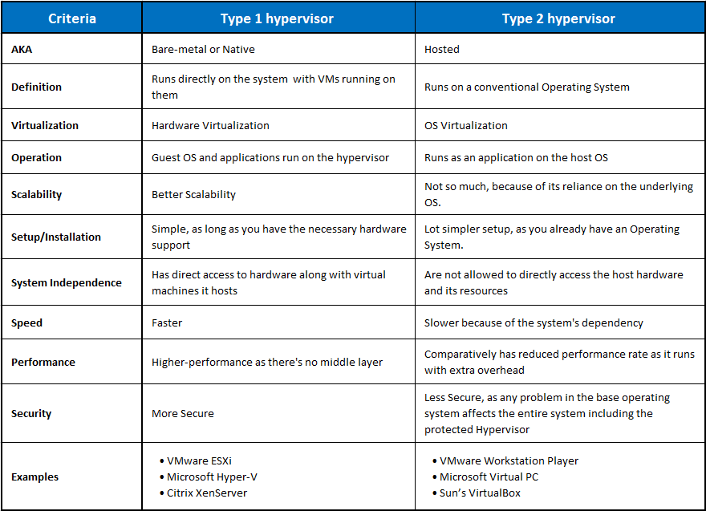

**Was versteht man unter Applikationsvirtualisierung?**

Applikationsvirtualisierung bedeutet, dass eine Anwendung isoliert vom Betriebssystem ausgeführt wird und eine Schicht zwischen diesen als Laufzeitumgebung zur Verfügung stellt. Oft in einer Sandbox oder Container. Dadurch lassen sich Anwendungen unabhängig vom zugrunde liegenden System bereitstellen und ausführen. Eine einzelne Anwendung die man einfach virtualisiert zur Verfügung stellt.

- Microsoft App-V
- Citrix Virtual Apps

**Was versteht man unter Desktop-Virtualisierung (VDI)?**

Virtual Desktop Infrastructure (VDI) ermöglicht die Bereitstellung virtueller Desktops von einem zentralen Server. Benutzer greifen über Remote-Protokolle (z. B. RDP, PCoIP) auf ihre Desktops zu, anstatt eine lokale Installation zu nutzen. Somit bietet dies einen Zugriff von überall, eine zentrale Verwaltung mit Sicherheit und geringerer Hardware-Bedarf bei End-Devices. Ein ganzes OS das man virtualisiert zur Verfügung gestellt bekommt. Per Thin Client oder Remote Protocol.

- VMware Horizon
- Citrix Virtual Desktops
- Microsoft Azure Virtual Desktop

**Wie unterscheiden sich Container von virtuellen Maschinen?**


Ein Container ist ein Software-Codepaket, das den Code einer Anwendung, ihre Librairies und andere Dependencies enthält. Die Containerisierung macht Ihre Anwendungen portabel, so dass derselbe Code auf jedem Gerät ausgeführt werden kann. Eine virtuelle Maschine ist eine digitale Kopie eines physischen Rechners. Container werden sehr schnell gestartet und sind Light-Weighted. Containern greifen auf gemeinsamen Kernel zu, VMs haben alles selber installiert.

- Docker
- LXC
- Kubernetes
- VMWare
- VirtualBox
- Hyper-V

**Wie unterscheiden sich Emulation und Virtualisierung?**

Emulation: Sie ahmt die gesamte Hardware nach, so dass Software von einer Plattform auf einer anderen ausgeführt werden kann. Sie fungiert als Übersetzer zwischen der Software und dem Host-System. Virtualisierung: Teilt physische Hardwareressourcen in mehrere virtuelle Umgebungen auf, die sich jeweils wie eine eigene Maschine verhalten. Emulation fälscht die HW, also wenn wir etwas haben das nicht mit der HW die wir haben virtualisiert werden kann emulieren wir, z.B. Uralte-Games, im Normalfall geht das länger da wir hier mehr Rechenleistung brauchen.

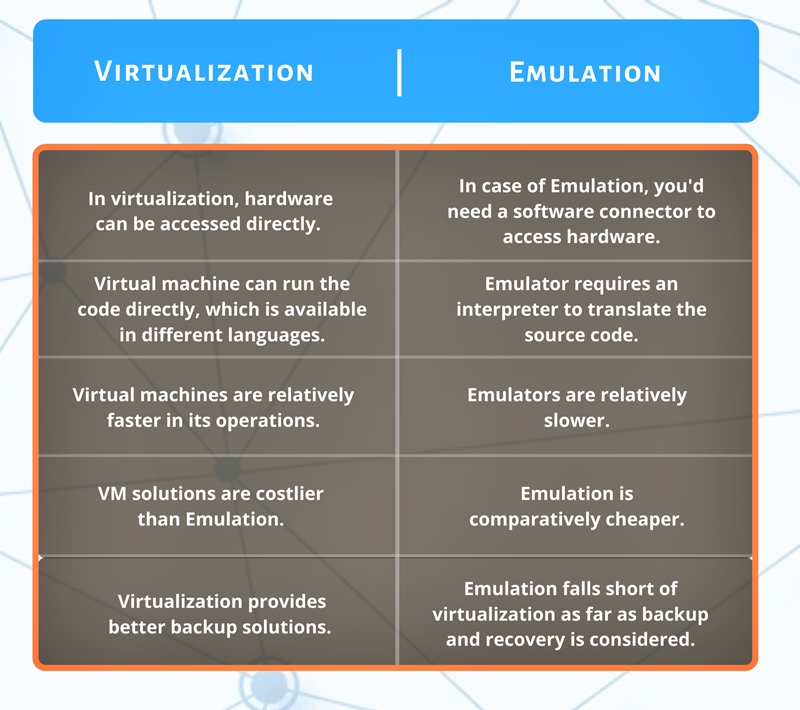


**Welche physischen IT-Ressourcen neben Servern können virtualisiert werden?**

- Storage (Storage Virtualization) → NAS, SAN, vSAN, Software-Defined Storage (SDS)

- Netzwerk (Network Virtualization) → VLANs, SDN, Virtual Switches, Router

- Desktops (VDI) → Virtuelle Arbeitsplätze in Rechenzentren

- Anwendungen (App Virtualization) → Isolierte Softwarebereitstellung

- GPU (GPU Virtualization) → Nvidia vGPU für virtualisierte Grafikprozesse

- Firewall (ich kann sie physisch einsetzen, man kann sie aber auch virtuell zur Verfügung stellen)


### 1.4 Auftrag: Remote Management - Info Zugangsdaten hosttech

**Welche physischen Server stehen zur Verfügung?**

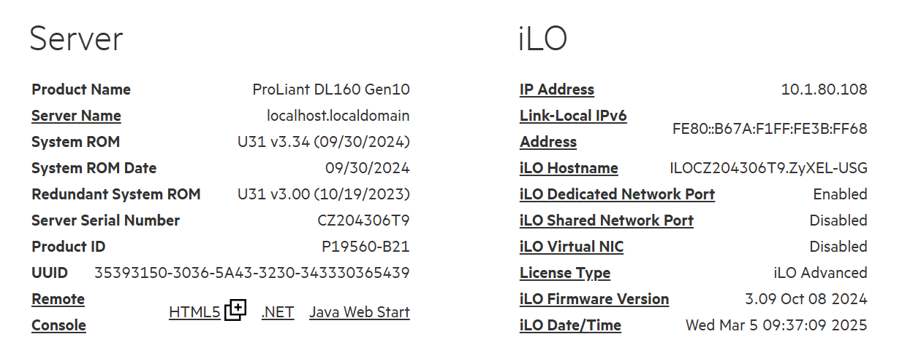

**Wie können Sie auf die physischen Server zugreifen?**

Über die URL und den uns zur Verfügung gestellten Benutzeranmeldeinformationen:
https://ilo.zli.hosttech.eu:4408/


**Welche öffentlichen IP Adressen können Sie für ihren Hypervisor und die virtuellen Maschinen verwenden?**

- 213.167.226.28
- 213.167.226.168

**Welche IP hat der der Storage Server?** 

- Ist der vom NAS, dieser muss wie mit dem Lehrer abgesprochen vordefiniert mitgeteilt werden.

**Was sind iLO, DRAC und IPMI?**

- iLO (Integrated Lights-Out) – Remote-Management-Technologie von HPE

- DRAC (Dell Remote Access Controller) – Remote-Management von Dell

- IPMI (Intelligent Platform Management Interface) – Standardisierte Schnittstelle für Server-Management (Herstellerübergreifend)

Diese Technologien ermöglichen die ferngesteuerte Verwaltung von Servern, auch wenn das Betriebssystem nicht läuft oder der Server abgestürzt ist.

**Wozu braucht man Remote Server Management Lösungen?**

- Fernwartung & Administration – Server kann auch ohne physischen Zugriff verwaltet werden

- Diagnose & Fehlerbehebung – Zugriff auf Logs, Hardware-Status & Fehlermeldungen

- Remote Power Control – Server ein-/ausschalten oder neustarten

- ISO-Mounting & Installation – Installation eines Betriebssystems über das Netzwerk

- Sicherheit & Monitoring – Permanente Überwachung von Temperatur, Lüftern & Hardware

**Wie viele und welche Prozessoren sind in ihrem Server verbaut?**

- [Link zum ILO](https://ilo.zli.hosttech.eu:4408/)

| **Spezifikation**          | **Wert**                                  |
| -------------------------- | ----------------------------------------- |
| **Name**                   | Intel(R) Xeon(R) Silver 4208 CPU @ 2.10GH |
| **Prozessortakt**          | 2,1 GHz                                   |
| **Ausführungstechnologie** | 8 Kerne / 16 Threads                      |
| **Speichertechnologie**    | 64-Bit fähig                              |
| **Interner L1-Cache**      | 512 KB                                    |
| **Interner L2-Cache**      | 8 MB (8192 KB)                            |
| **Interner L3-Cache**      | 11 MB (11264 KB)                          |

**Wie viel Memory steht zur Verfügung?**

Basierend auf den bereitgestellten Informationen zur physischen Speicherkonfiguration Ihres Systems ergibt sich folgende Tabelle:

| **DIMM-Steckplatz**    | **Status**  | **Grösse** | **Frequenz** | **Typ** |
| ---------------------- | ----------- | ---------- | ------------ | ------- |
| **Prozessor 1 DIMM 2** | In Gebrauch | 16,00 GB   | 2133 MHz     | RDIMM   |
| **Prozessor 1 DIMM 3** | In Gebrauch | 16,00 GB   | 2133 MHz     | RDIMM   |
| **Prozessor 1 DIMM 6** | In Gebrauch | 16,00 GB   | 2133 MHz     | RDIMM   |
| **Prozessor 1 DIMM 7** | In Gebrauch | 16,00 GB   | 2133 MHz     | RDIMM   |

**Wie können Sie den Server neustarten?**

- Mit dem Power-Button oben rechts

**Wie können Sie den Server von einem ISO Image starten?**

- In der Remote Console haben wir in einem neuen Fenster unsere leere Konsole aufgestartet, daraufhin drücken wir auf die CD um das lokale ISO hinzuzufügen (bei Erfolg erscheint ein Pfeil). Danach fügt man die Konfigs der Aufgabe 2.1 ein und öffnet die Weboberfläche des Exsi: [ILO-Exsi](https://213.167.226.28/ui/#/host/vms/3)
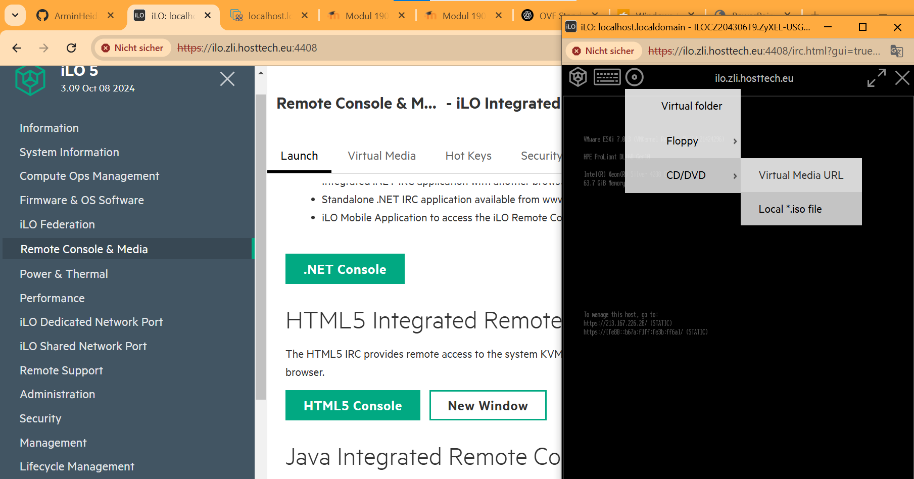

**Wie können Sie auf Tastatur, Bildschirm und Maus zugreifen?**

- Es geht auch so mit dem normalen Host den ich gerade (Notebook) benutze.

**Was bedeutet die Abkürzung iLO?**

iLO = Integrated Lights-Out (Fernverwaltungs-Technologie von HPE für Server-Management)


## 2. Block VMWare ESXi Server

**1. Installation ESXi Server** <br>
**2. Sicherheit und Isolierung**

### 2.1 Auftrag: Installation ESXi Server

**Hinweis:**
ESXi Installationen gehen nur mit SATA AHCI Support (BIOS Einstellung)

**Auftrag:**

1. Laden Sie die entsprechende ISO Datei "VMware-VMvisor-Installer-7.0U3l-21424296.x86_64.iso" vom TrueNAS Share herunter:
- TrueNAS: zli11-storage.hosttech.eu
- IP-Adresse: 213.167.226.31
- Windows (SMB): \\zli11-storage.hosttech.eu\iso
- Mac (SMB): smb://zli11-storage.hosttech.eu/iso
- Linux (NFS): /mnt/zli/iso
- Benutzername: zli-nas
- Passwort: 9BWEsJCc

- Legen Sie das ESXi ISO per iLO in ihren Server.
- Installieren Sie ESXi über die iLO Konsole:
- Konfigurieren Sie die statische IP Adresse, die gemäss Vorgabe zu ihrem Server gehört.
- Subnetzmaske: 255.255.255.0
- Standardgateway: 213.167.226.1
- DNS: 212.101.0.10, 212.101.4.253
- Öffnen Sie die Weboberfläche Ihres ESXi Servers.
- Wie viele Festplatten sind eingebaut? -> 1 ist eingebaut.
- Wie viel Speicherplatz haben sie zur Verfügung? -> 801.83GB
- Verbinden Sie ihren ESXi Server mit dem NFS Share Ihrer Gruppe.

**NFS Share**
- Host: zli11-storage.hosttech.eu
- IP-Adresse: 213.167.226.31
- NFS-Share: /mnt/zli/gruppe1
- Benutzername: zli-nas
- Passwort: 9BWEsJCc

### 2.2 Auftrag: Sicherheit und Isolierung

**Wie können Sie virtuelle Maschinen voneinander isolieren, um das Risiko von Sicherheitsverletztungen zu minimieren?**

- Netzwerksegmentierung & VLANs: Nutzung von VLANs, Virtuelle Switches & Portgruppen gezielt trennen

- Firewall-Regeln & Sicherheitsrichtlinien: NSX (Software-Defined Networking) oder externe Firewalls nutzen
Regeln für erlaubten Traffic zwischen VMs definieren

- VMware Security Features nutzen: VMX-Restriktionen (kein Copy-Paste, keine geteilten Laufwerke), Secure Boot & TPM aktivieren, Micro-Segmentation mit VMware NSX für Zero-Trust-Sicherheit

- Ressourcentrennung mit CPU/MEM Isolation: Affinity/Anti-Affinity-Rules für Workloads setzen
Resource Pools zur Begrenzung von Ressourcenverbrauch

- Keine unnötigen Verbindungen & Dienste: Deaktivieren von nicht benötigten Netzwerkinterfaces, keine offenen SSH- oder RDP-Verbindungen auf produktiven Systemen

- Isolation des Speichers: Eine weitere Möglichkeit, VMs zu isolieren, ist die Verwendung der Speichersegmentierung, bei der die Speicherressourcen getrennt werden, die von verschiedenen VMs verwendet werden. Die Speichersegmentierung kann mithilfe von Speicherpools, Verschlüsselung und Zugriffssteuerung implementiert werden.

- Hypervisor-Isolation: Die Verwendung der Hypervisorsegmentierung, bei der die Hypervisorschicht von den VMs und dem Hostbetriebssystem getrennt wird. Die Hypervisor-Segmentierung kann mithilfe von Typ-1- oder Bare-Metal-Hypervisoren, Sicherheitspatches und Härtung implementiert werden. Sie sind sicherer und effizienter als Typ-2- oder gehostete Hypervisoren, die auf einem Host-Betriebssystem ausgeführt werden und dessen Schwachstellen und Overhead teilen.

**Was versteht man unter Isolationsgrad?**

Der Isolationsgrad beschreibt, wie stark eine virtuelle Maschine (VM) von anderen VMs und dem Host-System getrennt ist. Es gibt VLANs aber auch vorallem Netzwerke wenn man Subnetze hat. Der Isolationsgrad beschreibt wie fest unabhängig die einzelnen Maschine von den anderen sind, es hat natürlich zwischen der Virtualisierungsmaschine zu tun, eine VM ist besser isoliert als Container die abhängig von anderen Containern sind. Dies wird festgestellt, dass bei einem Angriff nicht alles angegriffen wird, je höher die Isolation desto besser für die Virtuelle Instanz. Man kann auch RAM isolieren oder z.B. sagen für je einen CPU vergebe ich so viel RAM-Speicher.

Der Isolationsgrad beschreibt, wie stark virtuelle Maschinen oder Container voneinander und vom Hostsystem getrennt sind. Ein hoher Isolationsgrad erhöht die Sicherheit und Stabilität, da Probleme in einer VM oder einem Container die anderen nicht beeinflussen.

Ein hoher Isolationsgrad bedeutet:
- Keine gemeinsamen Ressourcen ausser Hypervisor
- Strikte Trennung auf Netzwerk-, Speicher- und CPU-Ebene
- Eingeschränkte Kommunikationsmöglichkeiten zwischen VMs

**Weshalb verfügt ihr ESXi Server über eine Host-Firewall?**

Die ESXi Host-Firewall verhindert ungewollte Verbindungen auf Management- und Service-Ports.
Sie filtert eingehenden und ausgehenden Netzwerkverkehr und schützt vor Angriffen.
Standardmässig erlaubt sie nur notwendige Dienste wie SSH, vSphere Client oder vMotion. Für die Verbindung zwischen der VMs, diese welche auf der gleichen HW laufen, Ports, von Innen nach Aussen. Angriffe von Aussen sollten ebenso geschützt sein vor einem Hypervisor.

Host-basierte Firewalls sind besonders in Umgebungen mit mehreren Netzwerken nützlich, da sie einen konsistenten Schutz gewährleisten, wenn sich das Gerät in verschiedenen Netzwerken bewegt oder ausserhalb des Schutzes einer Netzwerk-Firewall arbeitet.

**Wo können Sie die Host-Firewall ihres ESXi Servers konfigurieren?**

Über den vSphere Web Client:

1. Login in vSphere Web UI (https://<ESXi-IP>/ui)
2. Links auf "Host" → "Einstellungen" → "Sicherheit & Firewall"
3.  Regeln aktivieren/deaktivieren oder anpassen

### 2.3 Auftrag Virtuelle Maschinen

**Lösen Sie die folgenden Aufgaben:**

**Installieren Sie eine Windows 10 oder 11 VM**

- Bei dieser Version vom Esxi war eine ältere, es gab W11 nicht als Option. Aus diesem Grund kam ein Fehler mit den Mindestanforderungen.

**Installieren Sie eine Linux VM**

**Wie viele CPU Cores haben Sie den VMs zugewiesen?**

- Der Windows VM 2 und der Linux Vm 1.

**Wie viel Memory haben Sie den VMs zugewiesen?**

- Der Windows VM 4 und Linux VM 2.

**Wie gross haben Sie die virtuellen Disks gewählt?**

- Bei der Windows VM zuerst 48GB aufgrund von Mindestanforderungen (64GB) auf 70GB und bei der Linux VM 16GB.

**Default-Werte**

- Diese sind je nach dem Anbieter definiert, Windows braucht mehr und tendenziell braucht ein Linux weniger. 

**Trouble-Shooting:**

- Es kam eine Meldung, dass die Mindestanforderungen trotzdem nicht erreicht wurden, hierbei wurde folgendes durchgeführt:

- [TPM-Requirements in Registry](https://www.robsteele.co/this-pc-cant-run-windows-11-on-esxi-7/)

- [TPM explained](https://support.microsoft.com/en-us/topic/what-s-a-trusted-platform-module-tpm-705f241d-025d-4470-80c5-4feeb24fa1ee)

**Weshalb ist es wichtig, dass Sie das richtige Gast OS auswählen?**

- Hardware-Kompatibilität & Treiber: ESXi optimiert virtuelle Hardware (z. B. Netzwerkkarten, Speichercontroller) je nach OS. Falsche Wahl → fehlende oder inkompatible Treiber → schlechte Netzwerk- oder Festplattenleistung. Wenn das Guest OS korrekt gewählt wird hat es eine bessere Geschwindigkeit, Effizienz und die optimalen Treiber.

- Funktionalität & Features: Manche Features (z. B. vMotion, Snapshots, VMware Tools) benötigen eine genaue OS-Erkennung. Diese sind essenziell für die Standard-Erkennung.

Die Einstellung des Guest OS wird bei der Erstellung der VM verwendet, um die geeignete virtuelle Hardware zu konfigurieren, die am besten für das Gastbetriebssystem geeignet ist, und sie wird auch für Standardkonfigurationseinstellungen und Optimierungen verwendet, um sicherzustellen, dass der Guest ordnungsgemäss funktioniert.

**Welche Aufgaben haben die VMware Tools auf einer VM?**

- Nahtlose Mausbewegung & Copy-Paste zwischen Host & VM. Zeit-Synchronisation mit dem Host.

- Erweiterte Verwaltungsfunktionen: Unterstützung für vMotion (Live-Migration ohne Neustart). Ermöglicht sauberes Herunterfahren & Neustarten über vSphere.

- Monitoring & Statusüberwachung: Meldet CPU-, RAM- und Netzwerkstatus der VM an den vSphere-Host.

- Installiert bessere Treiber für Grafik, Maus, Netzwerk und Speicher. Reduziert CPU-Last durch effizientes Speicher- und Energie-Management.

VMware Tools ist eine Reihe von Dienstprogrammen und Treibern, die die Leistung und Verwaltbarkeit einer virtuellen VMware-Maschine verbessern. Sie fungieren als Brücke zwischen dem Host- und dem Gastbetriebssystem und sorgen für eine nahtlose Interaktion zwischen den beiden Systemen.

VMWare Tools enthält alle Treiber und Software für das Betriebssystem, um korrekt und effizient mit dem Hypervisor (der VMWare darstellt) zu interagieren. Das Ziel des Hypervisors ist es, einen physischen Computer so gut wie möglich zu simulieren. Daher erscheint alles in VMWare (Video, Maus, Tastatur usw.) dem Gast als physische Hardware. VMWare schreibt jedoch spezielle Treiber, die die Leistung und Nutzbarkeit dieser virtuellen Hardware mit dem Gastbetriebssystem verbessern. Dazu gehören 3D-Beschleunigung, Grössenanpassung des Desktops an das VM-Fenster und nahtlose Mausunterstützung. Ohne diese Funktionen werden nur generische Hardwaretreiber verwendet, die zwar funktionieren, aber nicht optimal sind.


## 3. Block Virtuelle Disks und Storage PRÜFUNGSRELEVANT

**1. Disk Image Dateiendungen** <br>
**2. Provisionierung** <br>
**3. Speicherlösungen** <br>
**4. Backup von virtuellen Maschinen**

### 3.1 Auftrag: Disk Image Dateiendungen

**Zu welcher Virtualisierungslösung gehören Disk Images mit den folgenden Dateiendungen?**
- *.vhdx
- *.vdi
- *.vmdk
- *.qcow2 (haben wir auch im Proxmox)

| **Dateiendung** | **Virtualisierungslösung**         |
| --------------- | ---------------------------------- |
| **.vhdx**       | Microsoft Hyper-V                  |
| **.vdi**        | Oracle VirtualBox                  |
| **.vmdk**       | VMware (ESXi, Workstation, Fusion) |
| **.qcow2**      | QEMU/KVM (Quick Copy-On-Write 2)   |

**Wie kann man ein virtuelles Disk Image von einem Format in ein anderes konvertieren?**


**Methode 1: Mit qemu-img (empfohlen für viele Formate)**
Das Tool qemu-img unterstützt die Konvertierung zwischen .vhdx, .vdi, .vmdk, .qcow2 und weiteren Formaten.

Beispiel: VMDK → QCOW2
```Bash
# -f ist das Quellformat und -O ist das Zielformat
qemu-img convert -f vmdk -O qcow2 source.vmdk target.qcow2
```

Beispiel 2: VHDX → VMDK
```Bash
qemu-img convert -f vhdx -O vmdk source.vhdx target.vmdk
```

**Methode 2: Mit VirtualBox (VBoxManage)**

- Für VDI, VMDK und VHD kann auch VirtualBox genutzt werden:

Beispiel 1: VDI → VMDK

```Shell
VBoxManage clonehd source.vdi target.vmdk --format VMDK
```

Beispiel 2: VMDK → VDI

```Shell
VBoxManage clonehd source.vmdk target.vdi --format VDI
```

**Methode 3: Mit VMware Converter (für VMDK & VHDX):**
- VMware vCenter Converter kann VHDX zu VMDK umwandeln, auch direkte Migration von Hyper-V zu ESXi möglich

**Methode 4: Disk2vhd und V2V / P2V Converter:**

Disk2vhd ist ein Dienstprogramm, das VHD-Versionen (Virtual Hard Disk - Microsofts Festplattenformat für virtuelle Maschinen) von physischen Festplatten zur Verwendung in virtuellen Maschinen (VMs) von Microsoft Virtual PC oder Microsoft Hyper-V erstellt. Der Unterschied zwischen Disk2vhd und anderen Tools zur Umwandlung von physischen in virtuelle Festplatten besteht darin, dass Sie Disk2vhd auf einem System ausführen können, das online ist. Disk2vhd nutzt die in Windows XP eingeführte Volume Snapshot-Funktion von Windows, um konsistente Point-in-Time-Snapshots der Volumes zu erstellen, die Sie in eine Konvertierung einbeziehen möchten. Sie können Disk2vhd sogar veranlassen, die VHDs auf lokalen Datenträgern zu erstellen, auch auf denen, die konvertiert werden (obwohl die Leistung besser ist, wenn sich die VHD auf einem anderen Datenträger befindet als die, die konvertiert wird).

[Microsoft Learn Disk2VHD](https://learn.microsoft.com/en-us/sysinternals/downloads/disk2vhd)

tarWind V2V Converter ist ein kostenloses Tool zum Klonen und Transformieren von VMs von einem Format in ein anderes sowie zum Konvertieren von physischen in virtuelle Maschinen. Es wird verwendet, wenn eine Migration oder ein Hypervisor-Switch erforderlich ist. Im Vergleich zu den typischen Konvertern, die in Hypervisoren eingebaut sind, bietet StarWind V2V Converter eine bidirektionale Konvertierung zwischen allen wichtigen VM-Formaten: VMDK, VHD/VHDX (Windows-Reparaturmodus berücksichtigt), QCOW2 und StarWind-native IMG.

**Methode 5: OVA / OVF**

Man kann immer in diesem Format ein Export und Import machen. Grundsätzlich wird ein OVA von sehr vielen Hypervisorn als Standard angesehen.

Das Open Virtualization Format (OVF) ist ein offener Standard zur Beschreibung und Verpackung von Software, die in virtuellen Maschinen läuft. Es wurde entwickelt, um die Portabilität und Interoperabilität von virtuellen Maschinen über verschiedene Virtualisierungsplattformen hinweg zu verbessern.

- .ovf-Datei: Eine XML-Datei, die die virtuellen Maschinen beschreibt und Metadaten wie Name, Hardwareanforderungen und Netzwerkeinstellungen enthält.
- Virtuelle Festplatten: Dateien, die die Festplatteninhalte der virtuellen Maschine speichern.
- Manifest- und Zertifikatdateien: Dateien zur Sicherstellung der Integrität und Authentizität des Pakets.

Diese Dateien ermöglichen es, virtuelle Maschinen konsistent und zuverlässig zwischen verschiedenen Virtualisierungsumgebungen zu übertragen.

Das OVF-Format wird von zahlreichen Virtualisierungsplattformen unterstützt, darunter VMware, VirtualBox, Microsoft Hyper-V und Citrix XenServer. Die Unterstützung durch diese Plattformen erleichtert die Migration und Bereitstellung von virtuellen Maschinen erheblich.

Eine OVA-Datei ist im Wesentlichen ein Tarball (eine Sammlung von Dateien, die in eine einzige Datei gepackt sind), die das Open Virtualization Format (OVF)-Verzeichnis enthält. OVF ist ein offener Standard für die Paketierung und Verteilung virtueller Appliances, wodurch das OVA-Format eine vereinfachte Verteilung von OVF-Paketen in einer einzigen Datei darstellt.


### 3.2 Auftrag: Provisionierung

Erklären Sie die folgenden Disk-Allokationsmethoden und nennen Sie Vor- und Nachteile:

Lehrer: Bei Thick wird der Block der Festplatte direkt reserviert (wenn wir sicher sein müssen das wir den Platz unbedingt brauchen, wenn man zu 100% sicher sein muss das wir Platz sperren müssen), bei Thin wird es dynamisch geschrieben. Bei Thick kann es niemand klauen. Bei Thin spart man einfach Kosten da man nix reservieren muss, man schaut einfach dass man genug Platz hat. Bei Lazy wird von Anfang an nichts auf 0 gesetzt ist einfach beim Schreiben dann langsamer. Bei Eager wird alles auf 0 gesetzt braucht zum aufsetzen einfach länger, das macht Unterschied wenn ich grosse Datenspeicher habe das ich lange warten muss,

**Thick Provision Lazy Zeroed**

- Speicherplatz wird sofort vollständig reserviert, aber nicht mit Nullen überschrieben.  
- Datenreste von vorherigen Dateien können theoretisch noch im Speicher vorhanden sein.  
- Nullung der Sektoren erfolgt erst beim ersten Schreibzugriff.

**Vorteile:**  
- Schnellere Erstellung der virtuellen Festplatte  
- Schutz vor Speichermangel, da Platz reserviert wird  
- Bessere Leistung als Thin Provision  

**Nachteile:**  
- Erster Schreibzugriff kann langsamer sein (weil Nullung erst dann passiert)  
- Höherer Speicherverbrauch als Thin Provision  

**Thick Provision Eager Zeroed**

**Erklärung:**  
- Speicherplatz wird sofort reserviert und mit Nullen überschrieben.  
- Dadurch gibt es keine Verzögerung beim ersten Schreibzugriff.  
- Wird für hochperformante Workloads (z. B. Datenbanken, vSAN, vMotion) empfohlen.  

**Vorteile:**  
- Beste Performance (direktes Schreiben möglich)  
- Höchste Sicherheit (keine Datenreste im Speicher)  
- Empfohlen für hohe IO-Workloads  

**Nachteile:**  
- Dauert länger bei der Erstellung (weil die Festplatte vorinitialisiert wird)  
- Belegt direkt den gesamten Speicherplatz  

**Thin Provision**

**Erklärung:**  
- Speicherplatz wird nicht sofort reserviert → wächst dynamisch mit dem Speicherbedarf der VM.  
- Dadurch kann mehr Speicherplatz overprovisioned werden (mehr VMs als physischer Speicher verfügbar).  
- Ideal für Test- und Entwicklungsumgebungen, aber mit Risiko eines Speichermangels.  

**Vorteile:**  
- Spart Speicherplatz → Mehr VMs auf weniger physischem Speicher  
- Sehr schnelle Erstellung der Festplatte  
- Flexibilität in Speicherverwaltung  

**Nachteile:**  
- Kann zu "Out of Space"-Fehlern führen, wenn der Host-Speicher voll ist  
- Performance schlechter als Thick Provision  
- Mehr Verwaltungsaufwand (Monitoring des Speicherverbrauchs notwendig)  

| **Allokationsmethode**           | **Speicherplatz wird sofort reserviert?** | **Sektoren mit Nullen überschrieben?** | **Performance (Schreibzugriff)?** |
| -------------------------------- | ----------------------------------------- | -------------------------------------- | --------------------------------- |
| **Thick Provision Lazy Zeroed**  | Ja                                        | Nein (erst beim ersten Zugriff)        | Mittel                            |
| **Thick Provision Eager Zeroed** | Ja                                        | Ja (komplett beim Anlegen)             | Hoch                              |
| **Thin Provision**               | Nein (wächst dynamisch)                   | Nein (erst beim Schreiben)             | Niedrig bis Mittel                |

| **Anwendungsfall**                                                   | **Empfohlene Methode**          |
| -------------------------------------------------------------------- | ------------------------------- |
| **Produktivumgebung mit hoher Performance**                          | Thick Provision Eager Zeroed    |
| **Normale VMs mit guter Performance, aber schneller Bereitstellung** | Thick Provision Lazy Zeroed     |
| **Test- und Entwicklungsumgebungen**                                 | Thin Provision                  |
| **Storage-Effizienz mit Risiko-Management**                          | Thin Provision (mit Monitoring) |


### 3.3 Auftrag: Speicherlösungen

**Was versteht man unter Write-Back Cache?**

Ein Write-Back Cache ist eine Caching-Technik, bei der Daten zunächst nur in den Cache geschrieben werden. Die Aktualisierung des Hauptspeichers erfolgt erst, wenn der entsprechende Cache-Block ersetzt werden muss. Dies kann die Schreibgeschwindigkeit erhöhen, da nicht sofort auf den langsameren Hauptspeicher zugegriffen wird. Nachteil beim Stromausfall ohne USV besteht Datenverlust (inkonsistent). 

**Was versteht man unter Write-Through Cache?**

Bei einem Write-Through Cache werden Daten gleichzeitig sowohl in den Cache als auch in den Hauptspeicher geschrieben. Dies stellt sicher, dass der Hauptspeicher stets die aktuellsten Daten enthält (konsistent), kann jedoch die Schreibgeschwindigkeit beeinträchtigen, da jeder Schreibvorgang sowohl den Cache als auch den Hauptspeicher betrifft. Die Anwendung, die an der Erstellung dieser Daten arbeitet, hält die Ausführung zurück, bis die neuen Daten in den Speicher geschrieben sind.

**Welche Vor- und Nachteile haben SSD Festplatten beim Einsatz als VM Storage?**

**Vorteile**
- Hohe Geschwindigkeit und Energieeffizienz: SSDs bieten schnellere Lese- und Schreibgeschwindigkeiten im Vergleich zu herkömmlichen HDDs, was die Performance von VMs verbessert. Brauchen weniger Strom als die Mechanik der HDDs.

- Geringere Geräusche wie bei herkömmlichen HDDs.

- Geringere Latenz: Durch die fehlenden mechanischen Teile haben SSDs eine niedrigere Zugriffszeit, was zu schnelleren Datenzugriffen führt.

**Nachteile**
- Kosten: SSDs sind teurer pro Gigabyte im Vergleich zu HDDs.

- Speicherkapazität: SSDs bieten oft weniger Speicherkapazität als HDDs, was bei grossen Datenmengen relevant sein kann.

- Falls sie kaputt geht ist es schwerer etwas noch rauszuholen als bei HDDs. Z.B. bei einem Feuer die Wiederherstellung von HDDs konnte man noch lesen, die Elektronik war tot aber das Gehäuse war noch gut, wenn die Scheibe jedoch noch besteht dann kann man Daten noch auslesen. Die SSD wäre weg und wir könnten nichts zurückholen.

- Begrenzte Schreibzyklen, dann ist fertig. Man kann dann beim Aufbrauch die Daten nicht mehr abrufen.

**Welcher Eigenschaft ist entscheidend für Festplatten die Sie für einen Virtualisierungshost mit mehreren VMs verwenden wollen?**

Eine hohe IOPS (Input/Output Operations Per Second) Kapazität ermöglicht es, die Anforderungen mehrerer VMs gleichzeitig zu bewältigen, ohne Engpässe zu verursachen. Es wird z.B. mehrere VMs auf der gleichen Drive erstellt wo alle auf die gleiche Disk verwenden durchgehend, hier muss man Disks auf das ausrichten, damit sie so wiele Input und Outputs verarbeiten kann (parallel).

**Was versteht man unter shared Storage?**

Überbegriff für Möglichkeiten Daten zu speichern, ein zentraler Speicher für viele Hosts und Dateninkonsistenz wird verhindert wenn wir es an einem Ort haben und zusätzlich auch Datensicherheit. Herkömmlich sind NAS / SAN,.

Shared Storage konsolidiert Dateien und andere Informationen in einer zentralen Ressource, auf die mehrere Benutzer und Datensysteme gleichzeitig zugreifen oder sie gemeinsam nutzen können. Das Sammeln und Speichern von Daten in einer einzigen, gemeinsam genutzten Ressource rationalisiert Archivierungs- und Sicherungsprozesse und vereinfacht die Informationssicherheit. Dies ermöglicht es, Daten zentral zu speichern und von verschiedenen Hosts aus darauf zuzugreifen, was insbesondere in Cluster- oder Virtualisierungsumgebungen wichtig ist. Es ermöglicht auch eine Live-Migration (z.B. vMotion). Beispiele hierfür sind SAN, NAS, Ceph und GlusterFS.

**Was sind Vor- und Nachteile eines shared Storage für die virtuellen Disks?**

**Vorteile:**
- Hohe Verfügbarkeit: Bei Ausfall eines Hosts können andere Hosts weiterhin auf die Daten zugreifen.

- Einfache Migration: Virtuelle Maschinen können leichter zwischen Hosts verschoben werden.

- Zentrale Verwaltung: Erleichtert das Backup und die Verwaltung von Daten.

- Skalierbarkeit: Wenn wir genug verfügbaren Platz haben, können wir sehr schnell Disks hinzufügen, wir können so sagen wir vergrössern den Platz und alles andere bleibt bestehen.

**Nachteile:**
- Kosten: Shared Storage-Lösungen können teuer in der Anschaffung und Wartung sein.

- Komplexität: Die Implementierung und Verwaltung kann komplex sein und spezielles Fachwissen erfordern (z.B bei SAN mit Netzwerkschnittstellen)

- Single Point of Failure: Bei fehlender Redundanz kann der Ausfall des Shared Storage die gesamte Umgebung beeinträchtigen. Wenn der ausfällt dann wars das.

- Festplatten müssen schnell sein und zudem muss z.B. bei einem NAS das Netzwerk wichtig sein, dort haben wir allenfalls auch ein Problem (Bandbreite muss auch entsprechend aufgebaut sein).

**Wie unterscheiden sich die NFS I/O Modes sync und async?** 

- sync: Jeder Schreibvorgang wird sofort auf den Datenträger geschrieben. Dies gewährleistet Datenintegrität, kann jedoch die Performance beeinträchtigen. Der Schrittvorgang wird bestätigt sobald es abgespeichert wird. Ist langsamer aber konsistenter,

- async: Schreibvorgänge werden zunächst im Speicher gehalten und später auf den Datenträger geschrieben. Dies verbessert die Performance, birgt jedoch das Risiko von Datenverlusten bei einem Systemausfall. Schreibvorgang wird bestätigt sobald es abgeliefert wird, es ist schneller aber bei Stromausfall könnte es zu Dateninkonsistenz kommen.


### 3.4 Auftrag: Backup von virtuellen Maschinen

**Welche Möglichkeiten gibt es, eine virtuelle Maschinen zu sichern?**

- Image-basierte Backups: Erstellung eines vollständigen Abbilds der VM, einschliesslich aller Konfigurationen und Daten.​ Falls man also keine Snapshots hat, dann kann man den Ordner kopieren (pro VM wird ein Ordner erstellt in der Dateistruktur) und auch auf einen anderen Datenträger laden, dann haben wir ein Backup.

- Snapshot-basierte Backups: Erstellung eines Zustandsabbilds der VM zu einem bestimmten Zeitpunkt, um bei Bedarf darauf zurückgreifen zu können.​ Ausschliesslich bei virtuellen Umgebungen. Es ist eigentlich kein Backup, es speichert die Veränderungen, wenn aber das Grundbackup beschädigt wird, dann wars das. (Snapshot ist eigentlich kurzfristig was man schnell verwerfen sollte, ein SNapshot könnte korrupt sein oder ein Teil davon und dies betrifft dann alles was wir noch Snapshoten, also nicht direkt ein Backup was wir lange behalten sollten)

- Gastbetriebssystem-basierte Backups: Installation von Backup-Software innerhalb der VM, um spezifische Daten oder Anwendungen zu sichern.​

- Replikationen auf anderen Hosts (Site Recovery)

- Backup auf shared Storage oder in Cloud

**Welche Probleme gibt es bei der Sicherung von Datenbankservern?**

- Konsistenz der Daten: Laufende Transaktionen können zu inkonsistenten Backups führen, wenn sie nicht korrekt behandelt werden. Z.B. wenn wir plötzlich diese abbrechen und das im laufenden Betrieb sichern. Man muss also irgendwie einen kleinen Stopp machen um Daten zu sichern.

- Performance-Einbussen: Backup-Prozesse können die Leistung des Datenbankservers beeinträchtigen, insbesondere bei grossen Datenbanken.​

- Speicherbedarf: Grosse Datenbanken erfordern erhebliche Speicherkapazitäten für Backups.

- Recovery Time Objective (RTO) vlt kritisch

**Welche Gemeinsamkeiten haben Backups von Datenbankservern und VM-Disks?**

- Notwendigkeit der Konsistenz: Sowohl bei Datenbanken als auch bei VM-Disks ist es wichtig, konsistente Backups zu erstellen, um eine zuverlässige Wiederherstellung zu gewährleisten.​

- Ressourcenintensität: Beide Backup-Typen können erhebliche Systemressourcen beanspruchen und die Performance beeinträchtigen.​

- Beide werden konstant aufgerufen also Verfügbarkeit.

- Speicheranforderungen: Backups von grossen Datenbanken und VM-Disks benötigen entsprechend viel Speicherplatz.

**Welche Vorteile bietet ein shared Storage für die Sicherung der virtuellen Maschinen?**

- Zentrale Speicherung: Ermöglicht eine zentrale Verwaltung und Sicherung von VM-Daten.​ Wir wissen wo wir die Backups haben mit einer schnelleren Wiederherstellung.

- Bessere Skalierbarkeit da man Speicher einfach erweitern kann.

- Hohe Verfügbarkeit: Bei Ausfall eines Hosts können andere Hosts weiterhin auf die VMs zugreifen.​

- Effiziente Ressourcennutzung: Ermöglicht konsolidierte Backups und reduziert den Speicherbedarf.​

- Unterstützung von Clustering: Ermöglicht den Einsatz von Cluster-Technologien für verbesserte Ausfallsicherheit.

## 4. Block Virtuelle Netzwerke, Switches und Snapshots

**1. Virtuelle Netzwerke** <br>
**2. Virtuelle Switches** <br>
**3. Virtuelle Netzwerkumgebung realisieren** <br>
**4. Snapshots und Clones** <br>

### 4.1 Auftrag: Virtuelle Netzwerke

Bei Virtualisierungslösungen, wie z.B.: VirtualBox oder VMware Player stehen folgende Netzwerkmodi zur Verfügung. 

**Wie unterscheiden sich diese Modi und wie werden Sie eingesetzt?**

**Not attached:**

- In diesem Modus wird der VM eine Netzwerkkarte zugewiesen, die jedoch nicht mit einem Netzwerk verbunden ist. Es ist, als ob kein Netzwerkkabel eingesteckt wäre.

- Use-Case: Nützlich für Testzwecke, bei denen die VM isoliert vom Netzwerk betrieben werden soll, um beispielsweise Netzwerkfehler zu simulieren oder die Reaktion des Systems auf fehlende Netzwerkverbindungen zu testen.

**NAT**

- Die VM nutzt die Netzwerkverbindung und des Hosts, wobei der Netzwerkverkehr der VM über die IP-Adresse des Hosts geleitet wird. Die VM befindet sich in einem eigenen, vom Host isolierten Netzwerk.

- Use-Case: Geeignet, wenn die VM Zugriff auf externe Netzwerke (z.B. Internet) benötigt, aber nicht von aussen erreichbar sein muss. Ideal für VMs, die webbasierten Zugriff benötigen, ohne spezielle Netzwerk-Konfigurationen. (z.B. im Auftrag öffetnliche IP des Routers wird verwendet für Internet-Zugangs unserer VM)

**Bridged**

- Die VM wird direkt mit dem physischen Netzwerk des Hosts verbunden und erhält eine eigene IP-Adresse im selben Netzwerksegment wie der Host.

- Use-Case: Empfohlen, wenn die VM wie ein eigenständiges Gerät im Netzwerk agieren soll, z.B. für Serverdienste oder Netzwerk-Simulationen, bei denen die VM von anderen Geräten im Netzwerk erreichbar sein muss.

**Internal Networking**

- Ermöglicht die Kommunikation zwischen VMs auf demselben Host, ohne dass der Host selbst oder externe Netzwerke Zugriff haben. Die VMs sind in einem isolierten Netzwerksegment verbunden.

- Use-Case: Ideal für Testumgebungen, in denen mehrere VMs miteinander kommunizieren sollen, ohne Einfluss auf das externe Netzwerk oder den Host zu nehmen.

**Host-Only Networking**

- Erstellt ein Netzwerk, in dem die VMs und der Host miteinander kommunizieren können, jedoch ohne Zugriff auf externe Netzwerke. Ein virtuelles Netzwerkinterface wird auf dem Host erstellt, das die Verbindung ermöglicht.

- Use-Case: Geeignet, wenn eine VM mit dem Host kommunizieren soll, aber keine Verbindung zum externen Netzwerk erforderlich oder gewünscht ist, z.B. für Entwicklungs- und Testzwecke. Also geht mit Host und VM die im gleichen Netz sind.

Die Wahl des passenden Netzwerkmodus hängt von den spezifischen Anforderungen der VM und der gewünschten Netzwerkinteraktion ab.


### 4.2 Auftrag: Virtuelle Switches

**Was ist ein vSwitch?**

- Ein vSwitch ist eine Softwarekomponente innerhalb einer Virtualisierungsplattform (Hypervisor) wie VMware ESXi, die den Netzwerkverkehr zwischen virtuellen Maschinen (VMs) und physischen Netzwerkadaptern (NICs / vmNICs) des Hosts leitet. Er fungiert ähnlich wie ein physischer Switch, ermöglicht die Kommunikation zwischen VMs auf demselben Host und leitet Daten an externe Netzwerke weiter. Er unterstützt VLAN-Tagging und Traffic Management.

- Ein emulierter Switch der die Connectivity durch die Portgruppen darstellt, je nach dem ob wir einen Uplink anbieten kommen wir auch ins Internet.

- **Uplink** bezeichnet die Verbindung oder den Kommunikationskanal, über den Daten von einem lokalen Netzwerk zu einem grösseren Netzwerk, wie dem Internet oder einem übergeordneten Netzwerk, übertragen werden. In der Netzwerktechnik ist der Uplink-Port eines Switches der Anschluss, der mit einem anderen Switch oder Router verbunden wird, um Datenverkehr zwischen verschiedenen Netzwerksegmenten zu ermöglichen. 


**Welche Eigenschaften hat vSwitch0?**

In VMware ESXi ist vSwitch0 der default erstellte virtuelle Switch, damit man die Management-Oberfläche überhaupt zur Verfügung hat. Was wichtig ist, dass er ins Internet rauskommen kann hat er eine IP mit GW zugewiesen, siehe Bild 7.4 Projekt realisieren, somit gelangen wir ins Internet, andere Switches sind nur als Bridged im internen Netz gedacht. **Für Prüfung: den Switch nicht abhängen, diese externe Verbindung!** Typische Eigenschaften sind:

- Standardverbindung: vSwitch0 verbindet die VMs mit den physischen Netzwerkadaptern des Hosts.

- Management-Netzwerk: Er enthält oft das Management-Netzwerk des ESXi-Hosts, über das Administratoren den Host verwalten.

- Portgruppen: vSwitch0 verfügt über vordefinierte Portgruppen wie "VM Network" für den VM-Datenverkehr und "Management Network" für Verwaltungszwecke.

- MTU Maximum Transmission Unit bezeichnet die maximale Grösse eines Datenpakets, das über ein Netzwerk übertragen werden kann. Die MTU beeinflusst die Effizienz der Datenübertragung; kleinere MTU-Werte können die Anzahl der übertragenen Pakete erhöhen, während grössere Werte die Effizienz steigern können, jedoch möglicherweise zu Fragmentierung führen, wenn die Paketgrösse die Kapazität des Netzwerks überschreitet.

- Unterstützt VLAN-Tagging


**Wie können Sie weitere vSwitches erstellen?**

- 1. Zugriff auf den ESXi Host Client: Melden Sie sich am ESXi Host Client an.

- 2. Navigieren zu "Netzwerk" > "Virtuelle Switches": Hier sehen Sie eine Übersicht der vorhandenen vSwitches.

- 3. Erstellen eines neuen vSwitch: Klicken Sie auf "Add Standard Virtual Switch", geben Sie einen Namen ein und weisen Sie bei Bedarf physische Netzwerkadapter zu.

- CLI geht auch:
```Shell
CLI (esxcli network vswitch standard add -v <switch-name>)
```

**Wie können Sie einen vSwitch mit einem physischen Switch verbinden?**

Muss eine Netzwerkkarte besitzen und einen Uplink. Nur die Uplinks definieren die wir auch möchten.

- 1. Zuweisung eines physischen Netzwerkadapters: Weisen Sie dem vSwitch einen oder mehrere physische Netzwerkadapter (NICs) des Hosts zu.

- 2. Verbindung zum physischen Switch: Schliessen Sie die zugewiesenen NICs an Ports des physischen Switches an.

- 3. Konfiguration des physischen Switches: Stellen Sie sicher, dass die entsprechenden Ports des physischen Switches korrekt konfiguriert sind, insbesondere wenn VLANs oder Trunking verwendet werden.

- Man kann auch Bridged Networking oder einen Uplink Port z.B. in VMWare benutzen.


**Was ist ein VLAN?**

- Ein VLAN ermöglicht es, ein physisches Netzwerk in mehrere logische Netzwerke zu unterteilen (Layer-2 Segmentierung auf Layer-1). Dadurch können Geräte, die physisch an denselben Switch angeschlossen sind, in separaten Broadcast-Domänen operieren, was die Netzwerksegmentierung und -sicherheit verbessert.

**Was versteht man unter Trunk?**

- Ein Trunk ist eine Netzwerkverbindung, die mehrere VLANs über eine einzige physische Leitung transportiert. Durch das Hinzufügen von VLAN-Tags zu Ethernet-Frames können Switches erkennen, zu welchem VLAN der jeweilige Frame gehört, wodurch die effiziente Übertragung mehrerer VLANs über eine gemeinsame Verbindung ermöglicht wird.

- Oder wenn man mehrere Netzwerkkabel in eines zusammenschweisst in ein Logisches und somit eine grössere Bandbreite erhaltet, vorallem bei Servern damit dort diese für die Servern höher sind (NAS als Beispiel). 

**Wie können Sie einen vSwitch mit einem VLAN verbinden?**

- Erstellen oder Bearbeiten einer Portgruppe: Legen Sie eine neue Portgruppe an oder bearbeiten Sie eine vorhandene auf dem vSwitch.

- Zuweisung der VLAN-ID: Geben Sie in den Einstellungen der Portgruppe die entsprechende VLAN-ID an, die dem gewünschten VLAN entspricht.

- Zuweisung der Portgruppe zu VMs: Weisen Sie die VMs der konfigurierten Portgruppe zu, damit sie dem entsprechenden VLAN angehören

- (Zusatz) VLAN-ID in den vSwitch-Portgruppen konfigurieren.

- (Zusatz) Switch-Port als Trunk mit passenden VLANs konfigurieren.

- (Zusatz) VLAN-Tagging in den VM-Netzwerkeinstellungen aktivieren.


Durch diese Konfiguration wird der Netzwerkverkehr der VMs korrekt in das entsprechende VLAN geleitet. Damit ich ein Gerät an einem vSwitch benutzen kann muss ich auch eine Portgruppe definieren, der vSwitch ist eigentlich einer ohne Anschlüsse, mit dieser Gruppe gebe ich die Anschlüsse jedoch an, ich kann auch mehrere daran hinzufügen. 0 ist die Standard-VLAN-ID.


### 4.3 Auftrag: Virtuelle Netzwerkumgebung realisieren

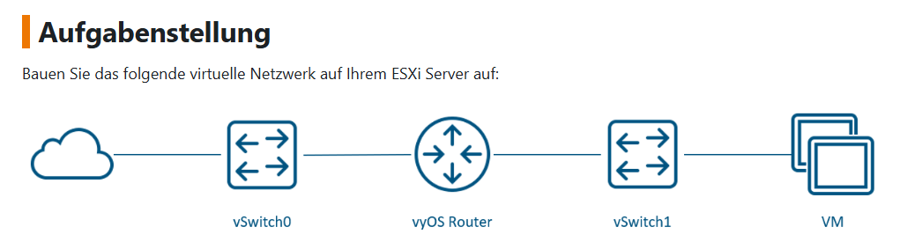

**Welche VMs benötigen Sie?**

- Windows VM (W11)
- VyOS VM (Router)

**Wie viele Netzwerkadapter müssen den VMs zugewiesen werden?**

- Für den Routern müssen wir jeweils 2 Adapter (WAN und LAN) zuweisen
- Für den Client müssen wir jeweils 1 Adapter (LAN) zuweisen

**Welche IP Adressen werden verwendet?**

- 213.167.226.1 (GW WAN)
- 213.167.226.168 (WAN)
- 192.168.0.1 (Router IP)
- 192.168.0.10 (Client-IP)
- 8.8.8.8 (Client-DNS)

**Wird bei diesem Setup NAT benötigt?**

- Ja, geeignet, wenn die VM Zugriff auf externe Netzwerke (z.B. Internet) benötigt, aber nicht von aussen erreichbar sein muss. Ideal für VMs, die webbasierten Zugriff benötigen, ohne spezielle Netzwerk-Konfigurationen. (z.B. im Auftrag öffentliche IP des Routers wird verwendet für Internet-Zugangs unserer VM)


**Wie können Sie testen, ob Ihr Setup funktioniert?**

- Mittels ping gegen Aussen oder Website-Aufrufe.

**Wie viele CPU Cores haben Sie den VMs zugewiesen?**

- Standardwerte für den Router 2
- Standardwerte für den Client 2

**Wie viel Memory haben Sie den VMs zugewiesen?**

- Standardwerte für den Router 2GB
- Standardwerte für den Cient 2GB

**Wie gross haben Sie die virtuellen Disks gewählt?**

- Standardwerte für den Router 20GB
- Standardwerte für den Cient 48GB


**optional: Richten Sie auf vyOS DHCP für die Clients ein.**

- Wurde gemacht und ist ebenso in der VyOS-Anleitung.

**optional: Erstellen Sie eine VM für einen Webserver in einem eigenen Netzwerksegment und versuchen Sie ihn von extern zu erreichen.**

- Nicht gemacht.

**Vorgehensweise:**

Zuerst diese Schritte machen mit den beiden Interfaces für ETH0 geben wir unsere WAN Adresse ein und für das LAN eine eigene private als Beispiel. Danach führen wir noch NAT durch für den Client (Windows) nach dieser Anleitung:
[VYOS-Anleitung](https://docs.vyos.io/en/latest/quick-start.html#quick-start)

Nun müssen wir mit dem Router pingen, hierfür brauchen wir die IP:
Basierend auf Ihrer Konfiguration (WAN: eth0 = 213.167.226.168, LAN: eth1 = 192.168.0.1, Windows-Client: 192.168.0.10) müssen Sie einen Standard-Routeintrag in VyOS hinzufügen, der den gesamten ausgehenden Verkehr über das WAN leitet.

Angenommen, Ihr ISP-Gateway (Next-Hop) hat die IP 213.167.226.1, würden Sie folgenden Befehl im Konfigurationsmodus eingeben:

```Shell
set protocols static route 0.0.0.0/0 next-hop 213.167.226.1
```

**Lösungsvorschlag: Virtuelle Netzwerkumgebung realisieren**
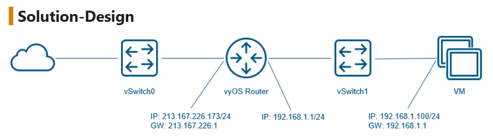

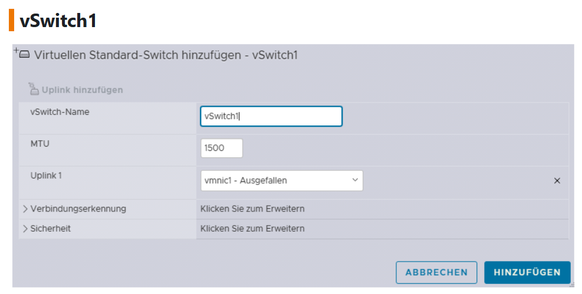
Nur die Uplinks definieren die wir auch möchten. Hier ist ein NIC bestehen aber es steckt kein Kabel drinnen, dann können wir auch einfach den Uplink entfernen,

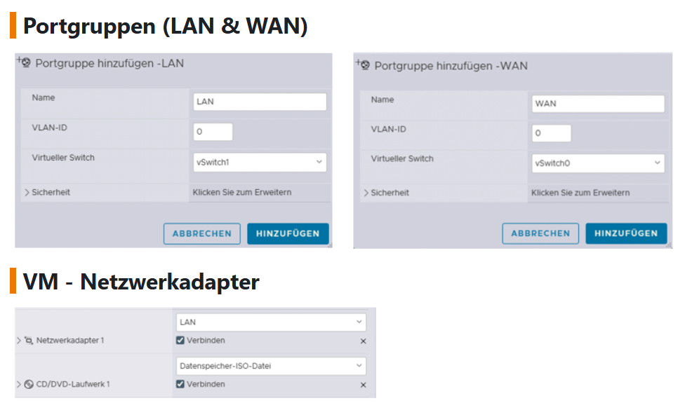

**VM-Konfig**
```Shell
IP-Adresse: 192.168.0.10
Subnetmaske: 255.255.255.0
Standardgateway: 192.168.0.1
Bevorzugter DNS-Server: 8.8.8.8
Alternativer DNS-Server: 4.4.4.4 # Habe ich nicht gesetzt
```

**vyOS Router - Netzwerkkonfiguration**
```Shell
install image
configure
set interfaces ethernet eth0 description WAN
set interfaces ethernet eth0 address 213.167.226.168/24
set protocols static route 0.0.0.0/0 next-hop 213.167.226.1
set interfaces ethernet eth1 description LAN
set interfaces ethernet eth1 address 192.168.0.1/24
commit
save
```

**vyOS Router - SSH**
```Shell
configure
set service ssh port 22
commit
save
```

**vyOS Router - NAT**
```Shell
configure
set nat source rule 100 outbound-interface name eth0
set nat source rule 100 source address 192.168.0.0/24
set nat source rule 100 translation address masquerade
commit
save
show interfaces
```

**vyOS Router - Port Forwarding (RDP)**
```Shell
configure
set nat destination rule 100 description 'Port Forwarding RDP'
set nat destination rule 100 destination port 3389
set nat destination rule 100 inbound-interface name eth0
set nat destination rule 100 translation address 192.168.0.10
set nat destination rule 100 protocol tcp
commit
save
```

**vyOS DHCP - DNS und DHCP Server (vyOS)**

- Die Standard-Gateway- und DNS-Recursor-Adresse lautet 192.168.0.1/24

- Der Adressbereich 192.168.0.2/24 - 192.168.0.19/24 und 192.168.0.101-192.168.0.254 wird für statische Zuweisungen reserviert

- DHCP-Clients erhalten IP-Adressen im Bereich 192.168.0.50 - 192.168.0.100 mit dem Domänennamen internal-network

- DHCP-Leases gelten für einen Tag (86400 Sekunden)

- VyOS dient als vollständiger DNS-Recursor und ersetzt die Nutzung von Google, Cloudflare oder anderen öffentlichen DNS-Servern (was gut für die Privatsphäre ist).

- Nur Hosts aus Ihrem internen/LAN-Netzwerk können den DNS-Recursor verwenden.

```Shell
set service dhcp-server shared-network-name LAN subnet 192.168.0.0/24 default-router '192.168.0.1'
set service dhcp-server shared-network-name LAN subnet 192.168.0.0/24 name-server '192.168.0.1'
set service dhcp-server shared-network-name LAN subnet 192.168.0.0/24 domain-name 'vyos.net'
set service dhcp-server shared-network-name LAN subnet 192.168.0.0/24 lease '86400'
set service dhcp-server shared-network-name LAN subnet 192.168.0.0/24 range 0 start '192.168.0.50'
set service dhcp-server shared-network-name LAN subnet 192.168.0.0/24 range 0 stop '192.168.0.100'

set service dns forwarding cache-size '0'
set service dns forwarding listen-address '192.168.0.1'
set service dns forwarding allow-from '192.168.0.0/24'
```

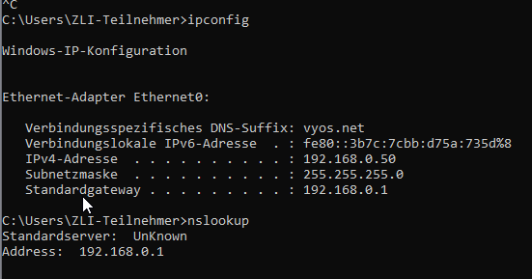

### 4.4 Auftrag: Snapshots und Clones

**Welche Daten werden bei einem VMware Snapshot gesichert?**

Ein VMware-Snapshot erfasst den Zustand der virtuellen Maschine (VM) zu einem bestimmten Zeitpunkt. Dabei werden folgende Komponenten gesichert:​

- VM-Einstellungen: Die Konfiguration der VM, einschliesslich Hardwareeinstellungen wie RAM und Cache.​

- Festplattenstatus: Der Zustand der virtuellen Festplatten zum Zeitpunkt des Snapshots.​

- Speicherstatus (optional): Der Inhalt des Arbeitsspeichers der VM mit Cache, sofern diese Option beim Erstellen des Snapshots gewählt wurde.

Diese Informationen werden in verschiedenen Dateien gespeichert, wie z. B. .vmdk (virtuelle Festplattendateien), .vmsd (Snapshot-Informationen) und .vmsn (Speicherstatus). Also nicht nur den Inhalt der Disk sondern auch sämtliche RAM-infos.

**Wie viel Speicherplatz benötigt ein Snapshot?**

Der Speicherbedarf eines Snapshots variiert und hängt von mehreren Faktoren ab:​

- Delta-Festplattendateien: Nach dem Erstellen eines Snapshots werden alle Änderungen an der VM in sogenannten Delta-Festplattendateien gespeichert. Der Speicherbedarf dieser Dateien wächst mit der Menge der Änderungen, die an der VM vorgenommen werden.

- Speicherstatus: Wenn der Speicherstatus der VM im Snapshot enthalten ist, benötigt dies zusätzlichen Speicherplatz, entsprechend der Grösse des zugewiesenen Arbeitsspeichers der VM.​ Daher kann der Speicherbedarf eines Snapshots von minimal bis zur Grösse der gesamten VM plus Arbeitsspeicher variieren.

**Lehrer:** Im Prinzip so viel wie die Maschine Platz benötigt, von der Auslastung der Disks, der RAM und die Konfigs speichern wir insgesamt 1zu1 gleich viel wie die VM selbst. Beim 2. Snapshot würden wir nur noch die Änderungen speichern, welche abhängig vom vorhergehenden Snapshot sind. Wenn wir also viele Abhängigkeiten haben ist es so, das wenn der erste ein Problem besitzt die anderen ebenso eines haben.

**Finden Sie heraus was die Snapshot Optionen bewirken?**
1. Revert (Wiederherstellen)
2. Edit (Umbenennen)
3. Delete (Löschen)

- Revert (Wiederherstellen): Setzt die VM auf den Zustand des ausgewählten Snapshots zurück, einschliesslich aller Einstellungen, Festplatten- und Speicherzustände.​ Der Platz wird dann wieder freigegeben.

- Edit (Umbenennen): Ermöglicht das Bearbeiten der Metadaten des Snapshots, wie z. B. Name oder Beschreibung, um eine bessere Identifizierung zu ermöglichen.​

- Delete (Löschen): Entfernt den Snapshot und integriert die Änderungen, die seit dem Snapshot vorgenommen wurden, in die Basisfestplatte. Dadurch wird der durch den Snapshot belegte Speicherplatz freigegeben. **Lehrer:** Alles wird was in den Snapshots drinnen ist wird zusammengeführt und der aktuelle Zustand fixiert, dann wird alles gelöscht.

**Was ist die empfohlene Maximaldauer eines VMware Snapshots?**

VMware empfiehlt, Snapshots nur kurzfristig zu verwenden, da sie sich negativ auf die Leistung der VM auswirken können. Snapshots sind nicht als langfristige Sicherungslösung gedacht und sollten idealerweise nicht länger als 72 Stunden aufbewahrt werden.

**Was versteht man unter Klon?**

- Full Clone (Vollständiger Klon): Eine vollständige Kopie der VM 1zu1, die unabhängig vom Original arbeitet und keine Ressourcen teilt.​

- Linked Clone (Verknüpfter Klon): Ein Klon, der auf einem Snapshot der Original-VM basiert und virtuelle Festplatten mit dem Original teilt. Änderungen werden in separaten Dateien gespeichert, wodurch Speicherplatz gespart wird. Allerdings bleibt der Linked Clone abhängig von der Original-VM. 

**Wie unterscheiden sich linked und full Clones?**

- Speicherbedarf: Linked Clones benötigen weniger Speicherplatz, da sie die Festplatten des Originals teilen, während Full Clones eine vollständige Kopie erstellen.​

- Unabhängigkeit: Full Clones sind vollständig unabhängig von der Original-VM. Linked Clones hingegen bleiben abhängig, da sie weiterhin auf die Festplatten des Originals zugreifen.​

- Erstellungszeit: Linked Clones können schneller erstellt werden, da keine vollständige Kopie der Festplatte notwendig ist.

**Erstellen Sie einen Snapshot Ihrer VMs.**

1. VM auswählen:​

2. Öffnen Sie den VMware vSphere Client und wählen Sie die gewünschte VM aus.​
Snapshot erstellen:​

3. Klicken Sie mit der rechten Maustaste auf die VM und wählen Sie „Snapshot“ > „Snapshot erstellen“.​
Details eingeben:​

4. Geben Sie einen Namen und eine Beschreibung für den Snapshot ein.​
Wählen Sie, ob der Speicherstatus der VM im Snapshot enthalten sein soll.​
Snapshot bestätigen:​

5. Klicken Sie auf „OK“, um den Snapshot zu erstellen.


## 5. Block Lizenzierung

**1. Lizenzierung von Windows Systemen**

### 5.1 Auftrag: Lizenzierung von Windows Systemen

**Welche Hauptversionen von Windows Server gibt es?**

- Windows Server 2022 Standard: Geeignet für Umgebungen mit geringer Virtualisierung.​

- Windows Server 2022 Datacenter: Optimiert für hochgradig virtualisierte Rechenzentren und Cloud-Umgebungen.​

- (Windows Server 2022 Essentials: Entwickelt für kleine Unternehmen mit bis zu 25 Benutzern und 50 Geräten.​ Nur für KMUs aber man darf hier **nicht virtualisieren**.)

**Was versteht Microsoft unter OSE, POSE und VOSE?**

- OSE (Operating System Environment): Eine Betriebssystemumgebung, entweder physisch oder virtuell, in der Anwendungen ausgeführt werden können.​ Ist vorallem beim Standard entscheidend, beim Datacenter ist es egal da wir beliebig viele brauchen können.

- POSE (Physical Operating System Environment): Eine physische Betriebssystemumgebung, die direkt auf der Hardware läuft.​

- VOSE (Virtual Operating System Environment): Eine virtuelle Betriebssystemumgebung, die innerhalb einer Virtualisierungslösung betrieben wird.

**Wie werden Windows Server lizenziert?**

Windows Server wird grundsätzlich nach der Anzahl der physischen Prozessorkerne (Cores) lizenziert:​

- Mindestlizenzierung: Es müssen mindestens 8 Cores pro Prozessor und mindestens 16 Cores pro Server lizenziert werden.​

- Lizenzpakete: Core-Lizenzen sind in 2-Core- und 16-Core-Paketen erhältlich.​

**Bei Virtualisierung:**

- Standard Edition: Erlaubt die Ausführung von bis zu zwei VOSEs pro lizenziertem Server.​

- Datacenter Edition: Erlaubt eine unbegrenzte Anzahl von VOSEs auf dem lizenzierten Server.

Zusätzlich zur Serverlizenz werden für den Zugriff auf den Server sogenannte Client Access Licenses (CALs) benötigt.​

**Wozu wird eine CAL benötigt?**

Eine Client Access Licence (CAL) ist erforderlich, damit Benutzer oder Geräte legal auf die Windows Server-Dienste zugreifen können. Im Prinzip eine AD-Verbindung oder Fileserver, falls man weniger User hat als Devices dann verteilt man ihnen mehr Lzenzen. Es gibt zwei Haupttypen von CALs:​

- User CAL: Lizenz für einen einzelnen Benutzer, der von beliebig vielen Geräten auf den Server zugreifen kann.​

- Device CAL: Lizenz für ein einzelnes Gerät, das von beliebig vielen Benutzern verwendet werden kann, um auf den Server zuzugreifen.

- Für Exchange oder SQl brauchen wir pro User auch nochmals Lizenzen. Dies ist nochmals eine andere Geschichte.

**Welchen Lizenztyp benötigen Sie für einen virtuellen Windows 11 Desktop?**

Für den Betrieb eines virtuellen Windows 11 Desktops benötigen Sie eine gültige Windows 11 Lizenz. Laut PC-WELT stellt eine virtuelle Maschine einen vollwertigen Rechner dar, weshalb für den Betrieb von Windows 10 und 11 in der VM eine gültige Windows-Lizenz erforderlich ist.

**Lehrer:** Wenn man es braucht dann eine VDA-Lizenz und ansonsten kann man auch ein normales Windows virtuell einsetzen, RDS wenn man Remotedesktop braucht kann man auch brauchen dann, ist aber spezieller.

- Windows Virtual Desktop Access (VDA) Licence:

Diese Lizenz ermöglicht den Zugriff auf virtuelle Windows-Desktops von Geräten, die nicht mit einer Windows Pro Lizenz ausgestattet sind. Sie ist besonders nützlich für Thin Clients oder Geräte mit anderen Betriebssystemen. Die VDA-Lizenz wird pro Benutzer vergeben.

- Remote Desktop Services (RDS) Lizenz:

Die RDS-Lizenz ermöglicht Benutzern den Zugriff auf Windows-Desktops und -Anwendungen, die auf Remote-Servern gehostet werden. Für den Zugriff auf virtuelle Desktops ist eine RDS-CAL (Client Access License) erforderlich. Diese Lizenz wird entweder pro Benutzer oder pro Gerät vergeben.

- Windows Enterprise Lizenz mit Software Assurance (SA):

Unternehmen mit einer Windows Enterprise Lizenz und aktiver Software Assurance sind berechtigt, Windows in virtuellen Umgebungen zu nutzen. Die Software Assurance bietet zusätzliche Vorteile wie Virtualisierungsrechte und erweiterte Nutzungsmöglichkeiten.

### 5.2 Auftrag: Lizenzierung

Ein Unternehmen mit 25 Mitarbeitenden verfügt über 7 physische Windows Server. Da die Hardware langsam veraltet ist, möchte der Geschäftsführer die gesamte Server Infrastruktur erneuern. Zudem möchte er für die 3 Aussendienst Mitarbeitenden virtuelle Windows Desktops betreiben.

**Bestehende physische Server:**
- Active Directory Domain Controller
- Active Directory Backup Domain Controller
- Datei Server
- Print Server
- VoIP Telefonie Server
- Exchange Server
- SQL Server

**Neue Hardware für den Virtualisierungshost:**
- 2x CPU mit 28 Cores (pro CPU)
- 8x 32GB Memory (256GB)
- 8x 8192 GB SSD Disks

**Wie viele Cores müssen Sie für die virtuellen Server lizenzieren?**

Die neue Hardware verfügt über 2 CPUs mit jeweils 28 Kernen, was insgesamt 56 Kerne ergibt. Bei der Verwendung der Windows Server Standard Edition müssen alle physischen Kerne lizenziert werden.

**Lehrer:** Bei Datacenter zahle ich die Kerne einmal also 56 Cores, bei Standard habe ich 224 Cores weil wir dort nur 2 maximale laufende Maschinen haben und wenn das nun mehr sind, brauchen wir mehr Lizenzen. Für unsere Zwecke müssen wir 4 Standard Lizenzen in Gebrauch nehmen. Pro Standardversion müssen wir also 4x 56 Cores virtualisieren und dann kommen wir auf 224. Wir brauchen erstmal eine Basislizenz und können dann eine Zusatzlizenz erwerben. Man muss noch abschätzen wenn ich künftig mehrere brauche dann sollte ich Datacenter wählen. Man muss es einfach abschätzen. Was man sagen muss auch die Version betrachten, falls wir einmal 2022 kaufen und dann 2025 müssen wir wieder den gleichen Preis zahlen ausser man holt eine SW-Assurance und zahlt ca. 10% pro Jahr.

[Licence-Calculator](https://www.sfc-software.de/special/win2022/) <br>
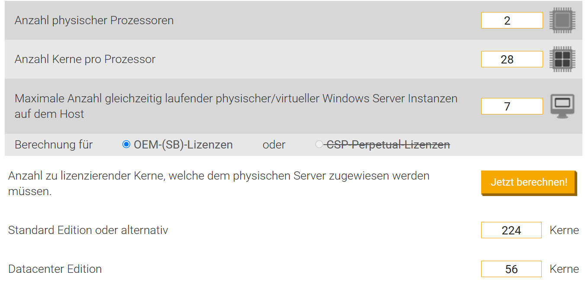

Somit wären 4 Lizenzen mit 28 Cores der Windows Server Standard Edition erforderlich, um 7 virtuelle Instanzen zu betreiben (1 Zusatz).

**Welche Serverversion würden Sie lizenzieren? Gäbe es Gründe, die nicht gewählte Version zu nehmen?**

Windows Server Standard Edition: Geeignet für Umgebungen mit geringer bis mittlerer Virtualisierung, da sie bis zu zwei virtuelle Instanzen pro Lizenz erlaubt.​ Wir haben hierbei nur 7 Server und könnten noch 1 zusätzlich bewirtschaften.

Windows Server Datacenter Edition: Empfohlen für hochgradig virtualisierte Umgebungen, da sie eine unbegrenzte Anzahl von virtuellen Instanzen pro lizenziertem Server ermöglicht. In diesem Fall, mit 7 virtuellen Servern und der Möglichkeit, in Zukunft weitere hinzuzufügen, könnte die Datacenter Edition wirtschaftlicher sein. Zudem ist mit dem Rechner ab 11 Virtuellen Instanzen bereits günstiger als die Standard Edition.

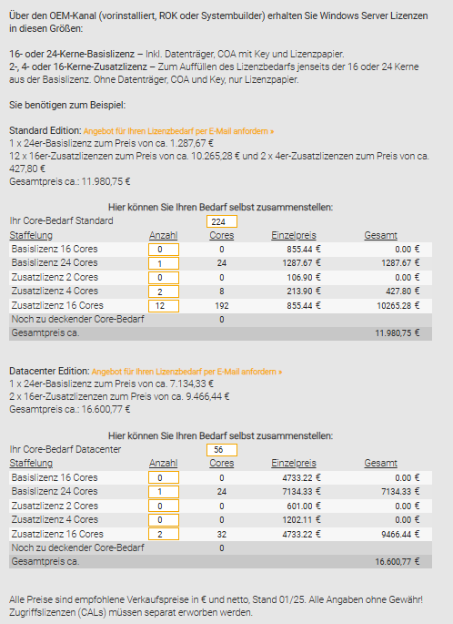

**Welche und wie viele CALs benötigen Sie?**

- User CALs: Da Ihr Unternehmen 25 Mitarbeitende hat, benötigen Sie 25 User CALs.​

- Remote Desktop Services (RDS) CALs: Für die 3 Aussendienstmitarbeitenden, die auf virtuelle Windows Desktops zugreifen, sind 3 RDS User CALs innerhalb den 25 erforderlich.

- Exchange brauchen wir nochmals 25

- Bei SQL brauchen wir auch wieder 25 Lizenzen

**Wie müssen die virtuellen Desktops lizenziert werden?**

Für die Bereitstellung virtueller Windows 11 Desktops benötigen Sie entsprechende Lizenzen. Gemäss den Lizenzbedingungen von Microsoft ist für den Betrieb von Windows 11 in einer virtuellen Maschine eine gültige Windows-Lizenz erforderlich. Es ist wichtig sicherzustellen, dass die Lizenzbedingungen von Microsoft eingehalten werden, insbesondere bei der Nutzung von Windows 11 in virtualisierten Umgebungen.​

Hinweis: Es wird empfohlen, einen Lizenzierungsexperten oder Microsoft-Partner zu konsultieren, um sicherzustellen, dass alle Lizenzierungsanforderungen korrekt erfüllt werden und um die kosteneffizienteste Lösung für Ihr Unternehmen zu finden.

**Was ist günstiger virtuell oder physisch Lizenzierung?**

Grundsätzlich spielt es keinen immensen Unterschied ob es virtuell oder physisch lizenziert wird, auch den Standard-Server kann ich 2-Mal einsetzen. Man kann mit Virtualisierung durch so Betreibungskosten sparen aber nicht durch die Lizenzierung.


## 6. Block Physical to Virtual P2V

**1. VMware vCenter Converter**

### 6.1 Auftrag: VMware vCenter Converter

Der vCenter Converter hilft Ihnen dabei, physische Computer in virtuelle Maschinen umzuwandeln. Dies kann relativ einfach über die von VMWare zur Verfügung gestellte Software "vCenter Converter Standalone" durchgeführt werden.

[VMWare Converter Standalone](https://www.youtube.com/watch?v=Qp8lnJneYXw&ab_channel=GlobalTechnologyOptions)

**Fassen Sie die wichtigsten Schritte des Videos stichwortartig in Ihrer Dokumentation zusammen.**

- Provides an solution that automates the process of vreating VMWare vms from physical machines running Windows and Linux.

Consists of (CS = Converter Standalone):
- CS Server
- CS Worker
- CS Client
- CS Agent

Installation task can be done using:
1. Perform local Installation on Windows
2. Perform a Client-Server Installation on Windows
3. Perform CL-Installation in Windows

**Prozess:**
**Schritt 1:**
Converter bereitet Source Machine für Conversion vor -> Installiert Agent auf Source Machine und dieser erstellt Snapshots von Source Volumes

**Schritt 2:**
CS prepares VM auf Destination Host dann -> Agent kopiert Volumes der Source Macjine zur Destination Machine

**Schritt 3:**

Agent installiert Treiber die benötigt sind für OS und personalisiert VM -> Optional Agent auf Source Machine löschen

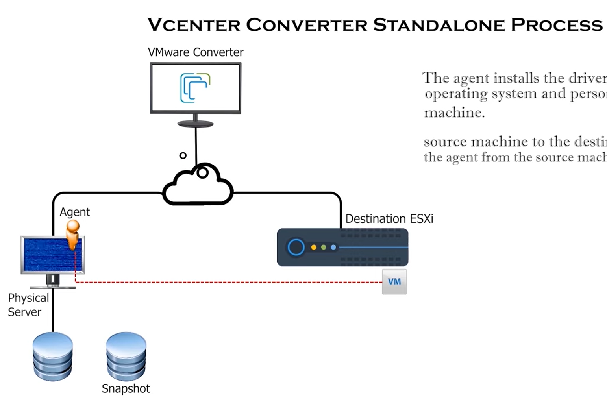

**Anleitung für beispielsweise ein Lab**

1. Download CS von VMWare Website

2. Local Installation auswählen

3. "Convert Machine" wählen in CS

4. Angaben wie IP, Remote Windows machine und User (admin) eingeben (wenn man automatisch auswählt dann deinstalliert es den Agent aus der Source wieder)

5. Falls wir Proxy Mode wählen, geht der Data-Traffic von der Source zum CS-Server dann zur Destination, ansonsten direkt von Source zu Destination

6. Destination Angaben wie oben (VMWare Infratsrucuture vm)

7. Da wir von Physisch zu VM gehen ist die Disk Thick Provisioned, falls wir Thin wollen -> In den Optionen -> Advanced die Art ändern 

**Es handelt sich hier um eine Live Migration/vMotion. Was bedeutet dies genau?**

Eine **Live-Migration** ermöglicht es, eine virtuelle Maschine (VM) während ihres Betriebs von einem physischen Host auf einen anderen zu verschieben, ohne dass es zu Ausfallzeiten kommt. Diese Technologie wurde erstmals 2003 von VMware mit der Einführung von vMotion vorgestellt und hat die Virtualisierung massgeblich vorangebracht.

**vMotion** ist die Bezeichnung von VMware für diese Funktion. Sie erlaubt es Administratoren, VMs nahtlos zwischen Hosts zu verschieben, um Wartungsarbeiten durchzuführen oder die Lastverteilung zu optimieren, ohne die Verfügbarkeit der Anwendungen zu beeinträchtigen.

**Live Migration** ist der entsprechende Begriff in Microsofts Hyper-V-Umgebung. Mit der Einführung von Windows Server 2008 R2 ersetzte Microsoft die vorherige "Quick Migration" durch die echte Live Migration, bei der VMs ohne Unterbrechung zwischen Hosts verschoben werden können.

Beide Technologien tragen dazu bei, die Flexibilität und Verfügbarkeit in virtualisierten Umgebungen zu erhöhen, indem sie es ermöglichen, VMs dynamisch und ohne Ausfallzeiten zu verwalten.

## 7. Block Proxmox

**1. Installation Proxmox** <br>
**2. Proxmox VM Migration** <br>
**3. Linux Container** <br>
**4. Projekt Proxmox realisieren** <br>
**5. Backup** <br>
**6. Proxmox Cluster** <br>
**7. Monitoring** <br>
**8. Logging** <br>
**9. Automation** <br>

### 7.1 Auftrag: Installation Proxmox

Bevor Sie mit der Proxmox Installation beginnen, fahren sie die beiden VMs aus der Aufgabe 4.3 kontrolliert herunter. Stellen Sie sicher, dass die virtuellen Disks auf dem NAS Share ihrer Gruppe abgelegt sind.

1. Laden Sie den Proxmox VE 8.2 ISO Installer herunter.
2. Legen Sie das Proxmox ISO per iLO in ihren Server.
3. Installieren Sie Proxmox über die iLO Konsole:
4. Konfigurieren Sie die statische IP Adresse, die gemäss Vorgabe zu ihrem Server gehört .
4. Öffnen Sie die Weboberfläche Ihres Proxmox Servers.
5. Verbinden Sie ihren Proxmox Server mit dem NFS Share Ihrer Gruppe.

**NFS Share:**

- Host: zli11-storage.hosttech.eu
- IP-Adresse: 213.167.226.31
- NFS-Share: /mnt/zli/gruppe8
- Benutzername: zli-nas
- Passwort: 9BWEsJCc


Um Ihren Proxmox-Server mit dem NFS-Share Ihrer Gruppe zu verbinden, befolgen Sie bitte die folgenden Schritte:

**NFS-Share in Proxmox hinzufügen**:
- Melden Sie sich am Proxmox-Webinterface an.
- Navigieren Sie zu **Datacenter** > **Storage**.
- Klicken Sie auf **Add** und wählen Sie **NFS** aus.
- Füllen Sie die folgenden Felder aus:
- **ID**: Geben Sie einen eindeutigen Namen für das NFS-Storage ein, z.B. `gruppe8_nfs`.
- **Server**: `213.167.226.31`
- **Export**: `/mnt/zli/gruppe1`
- **Content**: Wählen Sie die Arten von Inhalten aus, die auf diesem Storage gespeichert werden sollen, z.B. `VZDump backup file`, `ISO image`, Disk Image, `Container template`.
- **Nodes**: Wählen Sie aus, auf welchen Proxmox-Knoten dieses Storage verfügbar sein soll.
- Klicken Sie auf **Add**, um das NFS-Storage hinzuzufügen.

**Verbindung testen**:
- Nach dem Hinzufügen sollte das neue NFS-Storage in der Storage-Liste erscheinen.
 - Um die Verbindung zu testen, können Sie beispielsweise eine ISO-Datei auf das NFS-Storage hochladen oder ein Backup darauf speichern.


### 7.2 Auftrag: VM Migration

**Was versteht man unter V2V?**

- V2V steht für "Virtual-to-Virtual" und bezeichnet den Prozess der Migration oder Konvertierung einer virtuellen Maschine (VM) von einer Virtualisierungsplattform zu einer anderen. Dies kann beispielsweise die Migration einer VM von VMware ESXi zu Proxmox VE oder von Microsoft Hyper-V zu VMware sein. Der V2V-Prozess ermöglicht es, virtuelle Maschinen zwischen verschiedenen Hypervisoren zu übertragen, um Flexibilität, Effizienz oder Kosteneinsparungen zu erreichen. Das Gegenstück wäre P2V wie mit dme Converter im vorherigen Abschnitt 6.

**Welchen Hypervisor verwendet Proxmox und VMWare Exsi?**

- Proxmox VE verwendet den Hypervisor KVM (Kernel-based Virtual Machine). KVM ist eine in den Linux-Kernel integrierte Virtualisierungstechnologie, die es ermöglicht, mehrere virtuelle Maschinen gleichzeitig auf einem physischen Host auszuführen. Zusätzlich integriert Proxmox VE LXC (Linux Containers) für Container-Virtualisierung, was eine flexible und effiziente Verwaltung von Containern ermöglicht.

**Erklärungen:**

- Kernel-based Virtual Machine (KVM) is a free and open-source virtualization module in the Linux kernel that allows the kernel to function as a hypervisor. It was merged into the mainline Linux kernel in version 2.6. 20, which was released on February 5, 2007.

- In addition, KVM is an example of a Type-1 hypervisor, meaning that it runs directly on the underlying hardware rather than on a host operating system. This feature makes it more efficient than Type-2 hypervisors, which run on top of a host operating system.

- VMware ESXi ist ein **Typ-1-Hypervisor**, auch bekannt als Bare-Metal-Hypervisor. Dieser wird direkt auf der Hardware eines physischen Servers installiert und ersetzt das herkömmliche Betriebssystem. Durch diese direkte Installation kann ESXi die physischen Ressourcen effizient verwalten und mehreren virtuellen Maschinen (VMs) zur Verfügung stellen.

**Welche Schritte sind notwendig, um eine ESXi VM auf Proxmox zu migrieren?**

**Sicherung der VM**:

- Bevor Sie mit der Migration beginnen, erstellen Sie eine vollständige Sicherung der VM, um Datenverlust zu vermeiden. Zudem Snapshots konsolidieren oder löschen.

**Export der VM aus ESXi**:

- Nutzen Sie das OVF-Tool von VMware, um die VM im Open Virtualization Format (OVF) zu exportieren. Dies stellt sicher, dass die VM in einem standardisierten Format vorliegt. Man kann auch die Virtual Disk respektive die vmdk-Datei kopieren und übertragen.

**Übertragung der Exportdateien zu Proxmox**:

- Kopieren Sie die exportierten OVF-Dateien / vmdk-Datei auf den Proxmox-Server, beispielsweise über SCP oder ein anderes Dateiübertragungsprotokoll.

**Import der VM in Proxmox**:

- Verwenden Sie die Proxmox-Weboberfläche oder CLI-Befehle, um die VM zu importieren. Passen Sie dabei die VM-Konfigurationen an die Proxmox-Umgebung an, wie z.B. Netzwerk- und Speicher-Einstellungen.

**Anpassung der VM-Konfiguration**:

- Nach dem Import sollten Sie die VM-Konfiguration überprüfen und gegebenenfalls anpassen, um sicherzustellen, dass sie optimal in der Proxmox-Umgebung funktioniert.

**Testen der VM**:

- Starten Sie die VM unter Proxmox und überprüfen Sie, ob sie fehlerfrei läuft. Testen Sie alle Anwendungen und Dienste innerhalb der VM, um sicherzustellen, dass die Migration erfolgreich war.

**Andere Links mit Anleitungen:**

- [Migration to Proxmox Wikipedia](https://pve.proxmox.com/wiki/Migrate_to_Proxmox_VE#Migration) <br>
- [Migration to Proxmox Video](https://www.proxmox.com/en/services/training-courses/videos/proxmox-virtual-environment/proxmox-ve-import-wizard-for-vmware)

Wir haben die VM von VYOS kopiert respektive die virtual disk ins NAS, nach dem hinzufügen des NAS gehen wir über die Proxmox-Shell und gehen in den korrekten Ordner mit den Dateien. Dort führen wir das aus in der Shell aus. Danach führen wir alles andere weiter durch, bei der VM sollte nun angezeigt werden, dass eine Unused Disk erscheint, diese können wir anwählen und einfach hinzufügen. Danach die Boot-Reihenfolge unter Options anpassen und nun sollte es funktionieren.

**Anleitung**
```Shell
# scp /mnt/pve/gruppe8_nfs/dump/vyos_v1-flat.vmdk root@proxmox_server:/mnt/pve/gruppe8_nfs/dump/vyos_v1-flat.vmdk 
# qemu-img convert -f vmdk vyos_v1.vmdk -O qcow2 vyos-v1.qcow2 -> Die ersten 2 Zeilen nicht benötigt, von anderen Anleitungen
qm disk import {target VMID} {vmdk file} {target storage}
qm disk import 100 vyos_v1.vmdk gruppe8_nfs
Successfully imported disk as 'unused0:gruppe8_nfs:100/vm-100-disk-0.raw'
```

- Once the import is done, the disk will show up as **unusedX** disk in the hardware panel of the VM.

- Attach the disk image to a bus. For this, double click or select it and hit the **Edit** button.

- Keep in mind that for a Windows VM, only IDE or SATA will work out of the box. After the migration, additional steps are necessary to switch to VirtIO.

- If the disk image is the boot disk, enable it and choose the correct boot order in the Options -> Boot Order panel of the VM.

**Auch für den unteren Abschnitt jetzt:**


**Migrieren Sie eine Ihrer VMs die Sie auf Ihrer ESXi Umgebung erstellt haben.**

**Import Disk:**
Here, the idea is to import the disk images directly with the qm disk import command. Proxmox VE needs to be able to access the ***.vmdk and *-flat.vmdk files**:

- The easiest way to set this up is a network share which can be accessed by both the source VMware cluster and the target Proxmox VE cluster. If the network share type is supported by Proxmox VE, you can directly add it as a storage.

- Alternatively, you can copy the files to a location accessible for Proxmox VE.

The **qm disk import** command will convert the disk image to the correct target format on the fly. We assume that the source VM is called "Server".

- Run through the [preparation](https://pve.proxmox.com/wiki/Migrate_to_Proxmox_VE#Preparation) steps of the source VM:

- Create a new VM on the Proxmox VE host with the configuration needed.

- In the "Disk" tab, remove the default disk.

- On the Proxmox VE host, open a shell, either via the web GUI or SSH. (Habe ich so gemacht)

- Go to the directory where the **vmdk** files are located. For example, if you configured a storage for the network share: **cd /mnt/pve/{storage name}/{VM name}**. Use the **ls** command to list the directory contents to verify that the needed files are present. In unserem Fall -> **cd /mnt/pve/gruppe8_nfs/dump**.

- The parameters for the command are: **qm disk import {target VMID} {vmdk file} {target storage}**. For example: **qm disk import 104 Server.vmdk local-zfs**. In unserem Fall -> **qm disk import 100 vyos_v1.vmdk gruppe8_nfs**.

**Note:** If the target storage stores the disk images as files, the **--format** parameter can be used to define the file format. Available are the following options: **raw, vmdk, qcow2**. The native format for QEMU/KVM is **qcow2**.

- Once the import is done, the disk will show up as **unusedX** disk in the hardware panel of the VM.

- Attach the disk image to a bus. For this, double click or select it and hit the **Edit** button.

- Keep in mind that for a Windows VM, only IDE or SATA will work out of the box. After the migration, additional steps are necessary to switch to VirtIO.

- If the disk image is the boot disk, enable it and choose the correct boot order in the Options -> Boot Order panel of the VM.

**Testen Sie ob Ihre VMs unter Proxmox fehlerfrei gestartet werden können.**

Nach der Migration ist es entscheidend, die Funktionalität der VM unter Proxmox zu überprüfen:

**Starten der VM**:

- Starten Sie die migrierte VM über die Proxmox-Weboberfläche oder die Kommandozeile.

**Überprüfung der Systemfunktionen**:

- Melden Sie sich an der VM an und prüfen Sie, ob alle Dienste und Anwendungen wie erwartet funktionieren.

**Netzwerk- und Speicherprüfung**:

- Stellen Sie sicher, dass die VM ordnungsgemäss mit dem Netzwerk verbunden ist und auf die erforderlichen Speicherressourcen zugreifen kann.

**Leistungsüberwachung**:

- Überwachen Sie die Leistung der VM, um sicherzustellen, dass sie unter Proxmox effizient läuft und keine Ressourcenengpässe bestehen.

### 7.3 Auftrag: Linux Container

**Was versteht man unter Proxmox Container?**

- Proxmox VE nutzt Linux-Container (LXC) als Virtualisierungstechnologie, um leichtgewichtige, isolierte Linux-Umgebungen bereitzustellen. Im Gegensatz zu vollständigen virtuellen Maschinen teilen sich Container den Kernel des Host-Systems, was zu geringeren Ressourcenanforderungen und höherer Effizienz führt. Allerdings können in Proxmox Containern ausschliesslich Linux-basierte Betriebssysteme betrieben werden; andere Systeme wie Windows oder FreeBSD sind nicht kompatibel.

**Wozu dienen Container Templates?**

- Container-Templates sind vorkonfigurierte Vorlagen, die die Erstellung neuer Container erleichtern und beschleunigen. Sie enthalten grundlegende Betriebssystem-Installationen und oft zusätzliche Pakete, die für spezifische Anwendungen oder Dienste erforderlich sind. Durch die Verwendung dieser Templates können Administratoren schnell und konsistent neue Container bereitstellen, ohne jedes Mal eine vollständige Installation durchführen zu müssen.

**Unter welchem Menüpunkt im Proxmox Webinterface können Sie Container Templates herunterladen?**

- Im Proxmox-Webinterface können Sie Container-Templates unter dem Menüpunkt "Storage" (Speicher) herunterladen. Navigieren Sie dazu zu Ihrem gewünschten Knoten, wählen Sie im linken Menü den entsprechenden Speicher (z.B. "local") aus und klicken Sie dann auf den Reiter "CT Templates" (Container-Vorlagen). Dort haben Sie die Möglichkeit, neue Templates herunterzuladen und vorhandene zu verwalten.

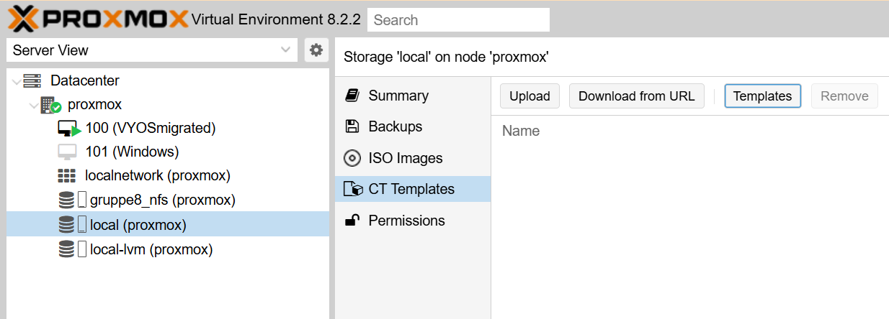

### 7.4 Auftrag: Projekt realisieren

[OPNSense-Installation auf Proxmox](https://www.zenarmor.com/docs/network-security-tutorials/opnsense-installation)

**Realisieren Sie den folgenden virtuellen Aufbau auf Ihrer Proxmox Umgebung:**
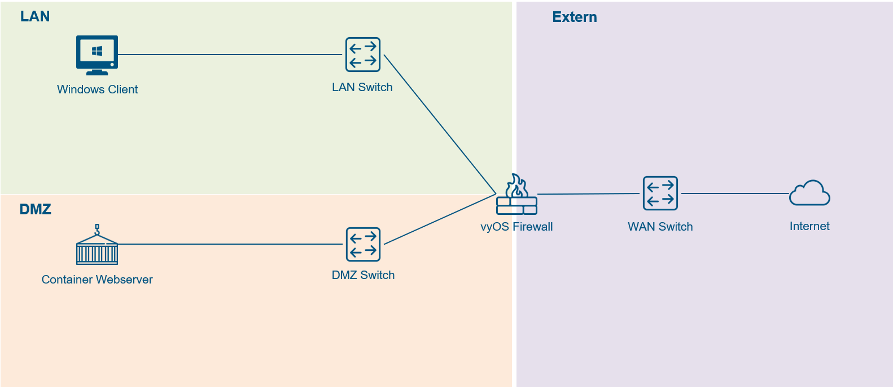

**Achtung: Verwenden Sie für jeden Proxmox Server der Klasse einen eigenen Hostnamen!**

**Stellen Sie sicher, dass Ihre virtuelle Umgebung folgende Anforderungen erfüllt:**

- Alle Clients im LAN haben Zugriff auf das Internet.

- Alle Clients in der DMZ haben Zugriff auf das Internet.

- Die Firewall kann von Aussen angepingt werden.

- Die Webserver in der DMZ sind von aussen über die IP der Firewall erreichbar.

**Netzwerkbrücken in Proxmox erstellen:** <br>

- Melden Sie sich am Proxmox Webinterface an.

- Navigieren Sie zu **"Rechenzentrum"** > **"Knoten"** > **"System"** > **"Netzwerk"**.

- Klicken Sie auf **"Erstellen"** > **"Linux Bridge"**.

- Erstellen Sie drei separate Bridges für LAN, DMZ und WAN, z.B.:
  - `vmbr0` für WAN
  - `vmbr1` für LAN
  - `vmbr2` für DMZ
  - Weisen Sie jeder Bridge die entsprechenden physischen Netzwerk-Schnittstellen zu.

- "vmbr" steht für Virtual Machine Bridge und bezeichnet in Proxmox VE eine virtuelle Netzwerkbrücke. Eine Netzwerkbrücke ermöglicht es virtuellen Maschinen, direkt mit dem physischen Netzwerk zu kommunizieren, als ob sie physische Netzwerkadapter verwenden würden. Dies erleichtert die Netzwerkverwaltung und verbessert die Netzwerkleistung innerhalb der virtuellen Umgebung.

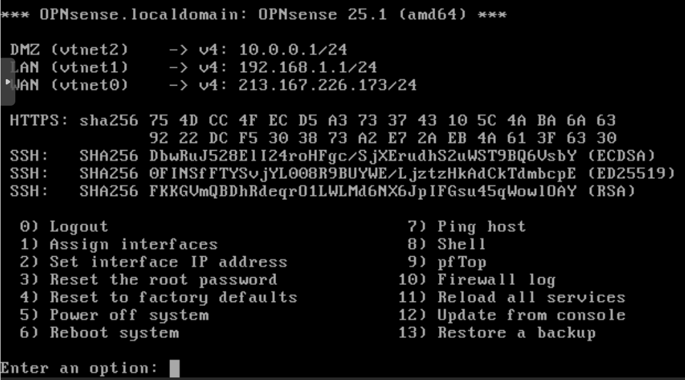

- **Bei den Interfaces ist zudem immer wichtig zu beachten, unter den Netzwerkeinstellungen der VM / des Containers auch den richtigen Switch auszuwählen, respektive beim Router bei der richtigen **Netzwerkkarte** den richtigen Switch auszuwählen.**

- Beispiele des Routers und des Windows-Client:

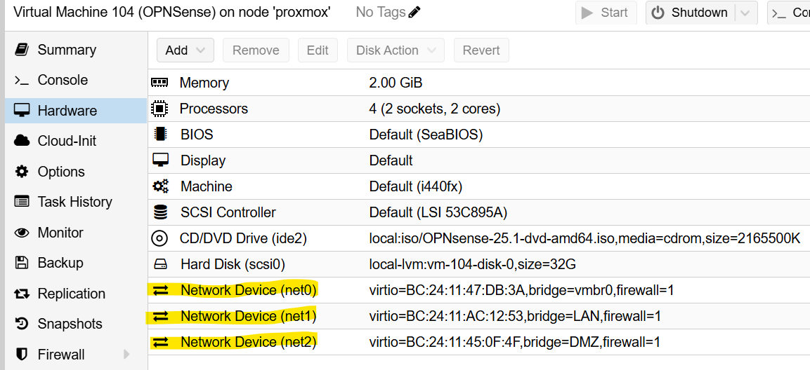
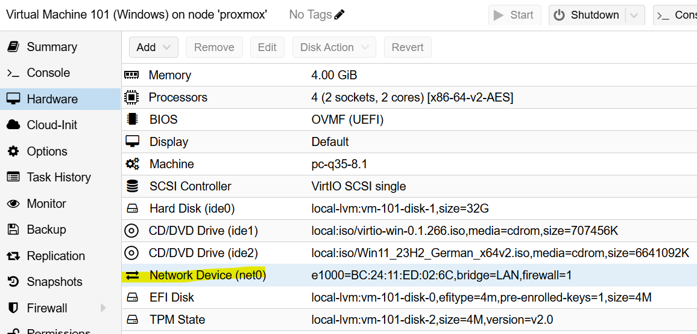

**Virtuelle Maschinen und Container (durch Template) erstellen und Netzwerk zuweisen:**

- Erstellen Sie eine VM und einen Container für Ihre Clients und Server.

- Weisen Sie den LAN-Clients die Bridge `vmbr1` zu.

- Weisen Sie den DMZ-Servern die Bridge `vmbr2` zu.

- Weisen Sie der Router-VM alle drei Netzwerk-Schnittstellen zu (davor mit entsprechender IP konfiguriert)

**Internet-Zugriff für LAN und DMZ prüfen**  

- OPNSense muss Gateway und DNS Server für WAN hinterlegt haben (haben wir gemacht mit Set IP Interface in der Konsole mit Upstream usw.)

- Prüft die Firewall-Regeln in OPNsense für LAN- und DMZ-Schnittstellen:  
  - Standardmässig darf LAN nach "any" raus (funktioniert Internetzugang?).  
  - DMZ muss ebenfalls eine Regel haben, die den Verkehr ins Internet erlaubt, hier können wir die analoge wie für LAN übernehmen.

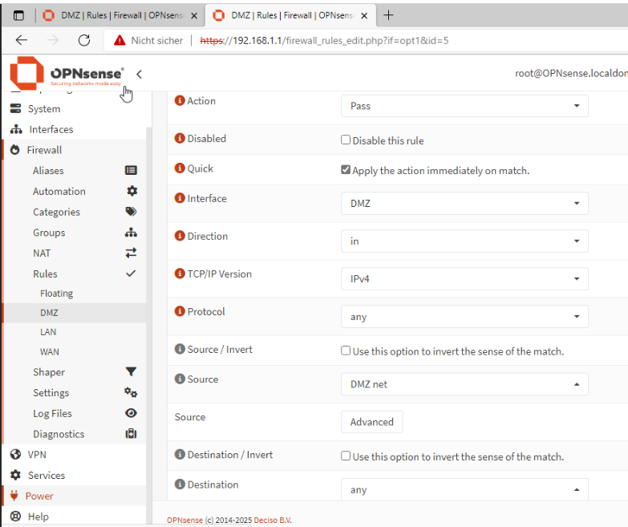
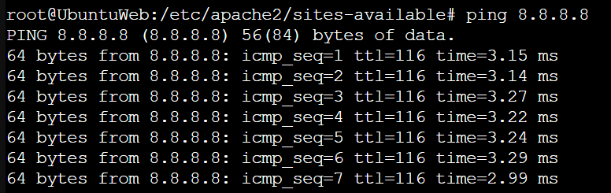
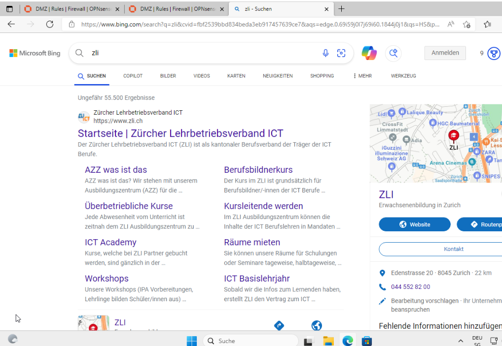

**Firewall von aussen pingbar machen**  

- Standardmässig blockiert OPNsense Ping-Anfragen (ICMP) von aussen.  

- Fügt in den WAN-Firewall-Regeln eine Regel hinzu:  
  - Protokoll: ICMP  
  - Quell-IP: any (oder spezifische erlaubte IPs)  
  - Ziel-IP: WAN-IP der Firewall / Router

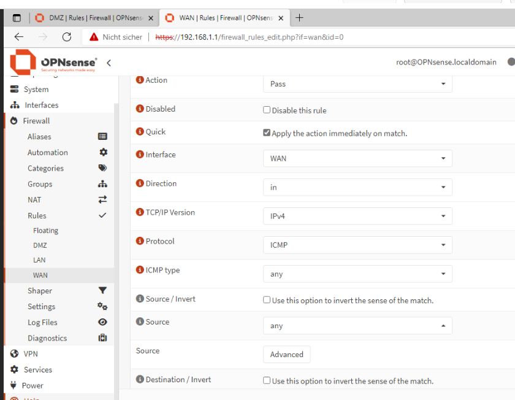
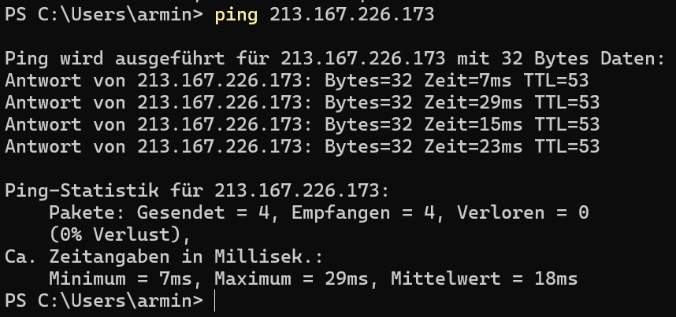

**Webserver in der DMZ von aussen erreichbar machen**

- Dafür muss **Port-Forwarding (NAT)** auf OPNsense eingerichtet werden:  
  
  - Ziel: Die externe Firewall-IP soll Anfragen auf Port **80 (HTTP)** oder 443 (HTTPS) an den Webserver in der DMZ weiterleiten.  
  
  - Richtige Firewall-Regeln auf WAN-Seite setzen:  
    - Erlaubt eingehenden Traffic auf Port 80/443 zur WAN-IP.  
    - Forwardet diesen an die interne DMZ-Webserver-IP.  
  
  - Prüft, ob der Webserver auch wirklich auf diesen Ports lauscht.

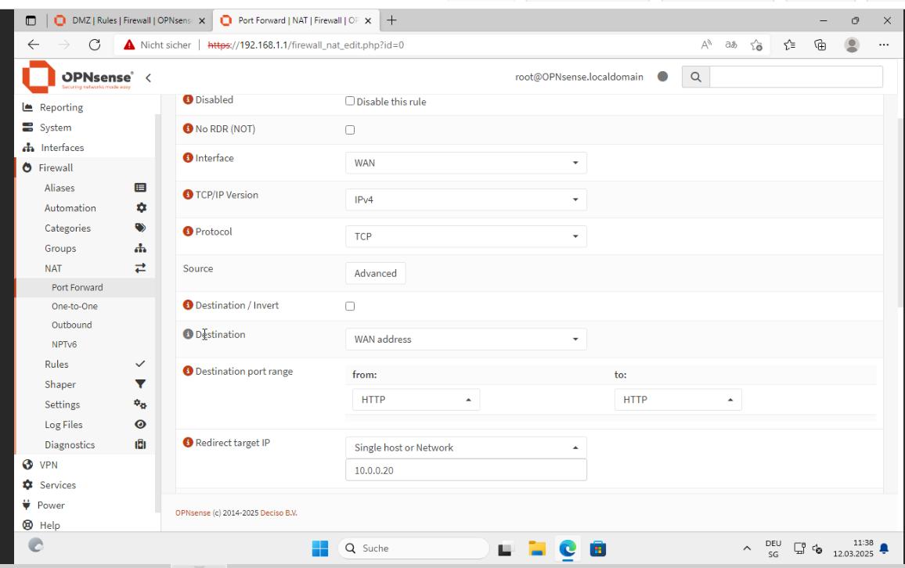
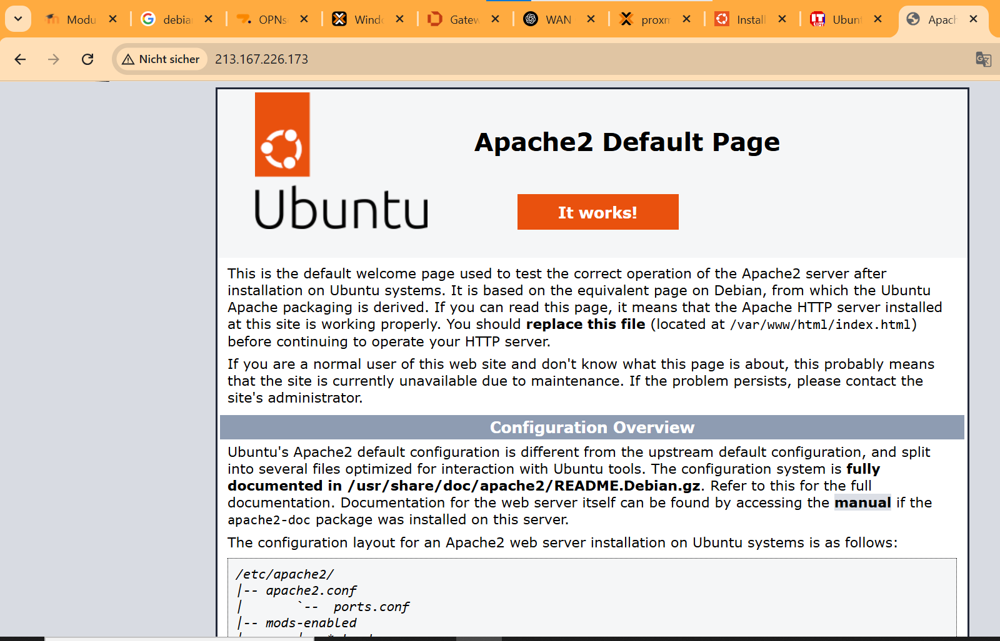

**Alternativ Übung mit VyOS statt OPNSense:**

```Shell
# vyOS Router - Netzwerkkonfiguration

configure
set interfaces ethernet eth0 description WAN
set interfaces ethernet eth0 address 213.167.226.173/24
set protocols static route 0.0.0.0/0 next-hop 213.167.226.1
set interfaces ethernet eth1 description LAN
set interfaces ethernet eth1 address 192.168.1.1/24
set interfaces ethernet eth2 description DMZ
set interfaces ethernet eth2 address 192.168.2.1/24
commit
save

# vyOS Router - SSH

configure
set service ssh port 22
commit
save

# vyOS Router - NAT

configure
set nat source rule 100 outbound-interface name eth0
set nat source rule 100 source address 192.168.1.0/24
set nat source rule 100 translation address masquerade
set nat source rule 200 outbound-interface name eth0
set nat source rule 200 source address 192.168.2.0/24
set nat source rule 200 translation address masquerade
commit
save

# vyOS Router - Port Forwarding (RDP & HTTP)

configure
set nat destination rule 100 description 'Port Forwarding RDP'
set nat destination rule 100 destination port 3389
set nat destination rule 100 inbound-interface name eth0
set nat destination rule 100 translation address 192.168.1.100
set nat destination rule 100 protocol tcp
set nat destination rule 200 description 'Port Forwarding HTTP'
set nat destination rule 200 destination port 80
set nat destination rule 200 inbound-interface name eth0
set nat destination rule 200 translation address 192.168.2.200
set nat destination rule 200 protocol tcp
commit
save

# vyOS Router - Zone Based Firewall

configure

# Erstellen der Firewall Regeln

set firewall ipv4 name local-lan default-action accept
set firewall ipv4 name local-wan default-action accept
set firewall ipv4 name local-dmz default-action accept
set firewall ipv4 name lan-local default-action drop
set firewall ipv4 name lan-local rule 10 action accept
set firewall ipv4 name lan-local rule 10 destination port 22
set firewall ipv4 name lan-local rule 10 protocol tcp
set firewall ipv4 name lan-wan default-action accept
set firewall ipv4 name lan-dmz default-action accept
set firewall ipv4 name wan-local default-action drop
set firewall ipv4 name wan-lan default-action drop
set firewall ipv4 name wan-lan rule 10 action accept
set firewall ipv4 name wan-lan rule 10 state established
set firewall ipv4 name wan-lan rule 10 state related
set firewall ipv4 name wan-lan rule 20 action accept
set firewall ipv4 name wan-lan rule 20 destination port 3389
set firewall ipv4 name wan-lan rule 20 protocol tcp
set firewall ipv4 name wan-dmz default-action drop
set firewall ipv4 name wan-dmz rule 10 action accept
set firewall ipv4 name wan-dmz rule 10 state established
set firewall ipv4 name wan-dmz rule 10 state related
set firewall ipv4 name wan-dmz rule 20 action accept
set firewall ipv4 name wan-dmz rule 20 destination port 80
set firewall ipv4 name wan-dmz rule 20 protocol tcp
set firewall ipv4 name dmz-local default-action drop
set firewall ipv4 name dmz-lan default-action drop
set firewall ipv4 name dmz-lan rule 10 action accept
set firewall ipv4 name dmz-lan rule 10 state established
set firewall ipv4 name dmz-lan rule 10 state related
set firewall ipv4 name dmz-wan default-action accept
commit
save

# Erstellen der vier benötigten Zonen (LOCAL, WAN, LAN, DMZ)

set firewall zone local local-zone
set firewall zone local from lan firewall name lan-local
set firewall zone local from wan firewall name wan-local
set firewall zone local from dmz firewall name dmz-local
set firewall zone wan interface eth0
set firewall zone wan from lan firewall name lan-wan
set firewall zone wan from local firewall name local-wan
set firewall zone wan from dmz firewall name dmz-wan
set firewall zone lan interface eth1
set firewall zone lan from local firewall name local-lan
set firewall zone lan from wan firewall name wan-lan
set firewall zone lan from dmz firewall name dmz-lan
set firewall zone dmz interface eth2
set firewall zone dmz from lan firewall name lan-dmz
set firewall zone dmz from local firewall name local-dmz
set firewall zone dmz from wan firewall name wan-dmz
commit
save
```

**Links die nützlich waren:**

[GW-Problem](https://docs.opnsense.org/manual/gateways.html) <br>
[OPNsense-Installation](https://www.zenarmor.com/docs/network-security-tutorials/opnsense-installation) <br>
[Webserver-Installation](https://ubuntu.com/tutorials/install-and-configure-apache#5-activating-virtualhost-file) <br>
[Ubuntu IP-Vergabe (wurde jedoch nicht mehr benötigt)](https://www.itslot.de/2014/02/ubuntu-ip-adresse-per-konsole-andern.html) <br>
[VirtIO Drivers (waren nicht essenziell)](https://pve.proxmox.com/wiki/Windows_VirtIO_Drivers)

### 7.5 Auftrag: Backup

**Welche Backup Möglichkeiten bietet Proxmox?**

- Backup-Speicher: Bevor ein Backup durchgeführt werden kann, muss ein Backup-Speicher definiert werden. Dies kann ein dedizierter Proxmox Backup Server sein, der erweiterte Funktionen wie Deduplizierung bietet, oder ein Dateispeicher wie ein NFS-Server (NAS).​

- Geplante Backups: Es können Backup-Jobs geplant werden, die automatisch zu festgelegten Zeiten für ausgewählte Nodes und Gast-Systeme ausgeführt werden.

**Optionen:**

- Classical vzdump [2] -> A full backup of all data per VM/CT is always generated here and written to a single file with vzdump. Compression (3 variants) is possible. A local storage, NFS or Samba can be used as a backup space, for example. Proxmox VE bietet verschiedene Methoden zur Sicherung von virtuellen Maschinen (VMs) und Containern. Eine zentrale Rolle spielt dabei das Tool **vzdump**, das speziell für Backups in Proxmox entwickelt wurde. `vzdump` ist ein Kommandozeilen-Tool, das vollständige Backups von VMs und Containern erstellt. Es unterstützt verschiedene Backup-Modi (3 unten aufgeführten Stop, Suspend, Snapshot)

- Proxmox Backup Server: Neben `vzdump` bietet Proxmox den Proxmox Backup Server an, eine dedizierte Lösung für effiziente und platzsparende Backups. Diese Lösung unterstützt inkrementelle und deduplizierte Backups, bei denen nur geänderte Daten seit dem letzten Backup gespeichert werden. Dies spart Speicherplatz und reduziert die Netzwerklast. Zudem wird die schnelle Zstandard (ZSTD) Kompressionsmethode verwendet, die ein hohes Kompressionsverhältnis bei hoher Geschwindigkeit bietet, gibt auch die anderen beiden.

**Weitere Backup-Strategien:**

- Externe Backup-Lösungen: Proxmox kann in bestehende Backup-Infrastrukturen integriert werden, die beispielsweise auf Netzwerk-Backup-Lösungen oder Cloud-Diensten basieren.

- Manuelle Backups: Administratoren können manuell Snapshots erstellen und diese auf externe Speicherorte kopieren.

**Wie unterscheiden sich Backup Modes Stop und Snapshot?**

**Stop-Modus:**

- Dieser Modus bietet die höchste Konsistenz des Backups, da die VM vollständig heruntergefahren wird, bevor das Backup startet. Nach Abschluss des Backups wird die VM wieder in den vorherigen Zustand versetzt.

**Vorgehensweise**
  1. Die VM wird ordentlich heruntergefahren.​
  2. Ein Hintergrundprozess sichert die VM-Daten.​
  3. Nach Abschluss des Backups wird die VM wieder gestartet, sofern sie zuvor lief.

- Es tritt eine kurze Ausfallzeit auf, da die VM während des gesamten Backup-Vorgangs nicht verfügbar ist.

- Dieser Modus eignet sich besonders für VMs, bei denen Datenkonsistenz höchste Priorität hat und eine kurze Ausfallzeit akzeptabel ist.

**Suspend-Modus:**

- Dieser Modus pausiert die VM und erstellt anschliessend einen Snapshot. Obwohl er eine geringere Ausfallzeit ermöglicht, kann er zu längeren Downtimes führen und bietet nicht unbedingt eine höhere Datenkonsistenz als der Snapshot-Modus.

**Vorgehensweise**
  1. Die VM wird in den Suspend-Modus versetzt (pausiert).​
  2. Es wird ein Snapshot des VM-Volumes erstellt.​
  3. Die VM wird aus dem Suspend-Modus wieder aufgenommen.

- Es kann zu einer verlängerten Ausfallzeit kommen, da die VM während des Snapshots pausiert ist.

- Dieser Modus wird hauptsächlich aus Kompatibilitätsgründen angeboten. Für eine bessere Balance zwischen Konsistenz und Ausfallzeit ist der Snapshot-Modus oft vorzuziehen.

**Snapshot-Modus:**

- Dieser Modus bietet eine Balance zwischen Datenkonsistenz und Ausfallzeit. Er erstellt einen Snapshot der VM, während diese weiterhin läuft. Wenn der Gast-Agent aktiviert ist, werden Funktionen wie das Einfrieren und Auftauen des Dateisystems genutzt, um die Konsistenz zu verbessern.

- **Vorgehensweise:**
  1. Proxmox VE führt ein Live-Backup durch, bei dem Datenblöcke kopiert werden, während die VM aktiv ist.
  2. Wenn der QEMU Guest Agent aktiviert und ausgeführt wird, werden zusätzliche Befehle wie `guest-fsfreeze-freeze` und `guest-fsfreeze-thaw` verwendet, um die Konsistenz zu verbessern.

- Es gibt eine minimale Ausfallzeit, jedoch besteht ein geringes Risiko von Inkonsistenzen, insbesondere wenn während des Backups Schreibvorgänge stattfinden.

- Dieser Modus ist oft die bevorzugte Wahl, da er eine gute Balance zwischen Performance und Datenkonsistenz bietet.

**Wozu dienen die Windows VirtIO Treiber und der Qemu-Guest-Agent?**

- **Windows VirtIO-Treiber:** Diese Treiber ermöglichen es Windows-Gastbetriebssystemen, paravirtualisierte Geräte wie Festplatten und Netzwerkadapter zu nutzen, was die Leistung gegenüber emulierten Geräten deutlich steigert. ​

- Diese Treiber verbessern die Kommunikation zwischen der virtuellen Maschine und dem Hypervisor, insbesondere in Bezug auf Netzwerk- und Festplattenoperationen.
  
- Durch den Einsatz der VirtIO-Treiber wird die I/O-Performance optimiert, was zu einer besseren Gesamtleistung der virtuellen Maschine führt.


- **QEMU-Guest-Agent:** Dieser Agent läuft innerhalb des Gastsystems und ermöglicht es dem Hypervisor, bestimmte Operationen im Gast durchzuführen, wie z. B. das Abrufen von Informationen, das Setzen der Systemzeit oder das Einfrieren des Dateisystems für konsistente Backups. Er ermöglicht es Proxmox, mit der VM zu kommunizieren, um konsistente Backups zu erstellen, ohne die VM herunterzufahren.

**Hauptfunktionen:**

- Datenkonsistenz bei Backups: Er sorgt dafür, dass das Dateisystem während des Backups eingefroren wird, um konsistente Sicherungen zu gewährleisten.

- Systeminformationen: Er ermöglicht dem Host, Informationen vom Gast zu erhalten, wie z.B. Systemzeit oder Dateisystemstatus.

- Verwaltungsfunktionen: Er unterstützt Funktionen wie das Suspendieren des Gasts oder das Setzen von Benutzerpasswörtern.

- Nutzen: Durch den Einsatz des QEMU-Guest-Agents wird die Interoperabilität zwischen Host und Gast verbessert, was zu einer effizienteren Verwaltung und besseren Integration führt.

- Wenn Backups (oder Snapshots) für VMs in Proxmox VE ausgelöst werden, muss sichergestellt werden, dass der Gast die letzten Änderungen in das Disk-Image geschrieben hat, bevor das Backup startet (oder der Snapshot erstellt wird). Dies wird durch den Qemu-Guest-Agenten innerhalb des Gastbetriebssystems erledigt.

[Qemi-Guest-Agent Installation](https://pve.proxmox.com/wiki/Qemu-guest-agent?ref=tanners-tech)

**Was bedeutet "vmbr" und was ist es?**

"vmbr" steht für **Virtual Machine Bridge** und bezeichnet in Proxmox VE eine virtuelle Netzwerkbrücke. Eine Netzwerkbrücke ermöglicht es virtuellen Maschinen, direkt mit dem physischen Netzwerk zu kommunizieren, als ob sie physische Netzwerkadapter verwenden würden. Dies erleichtert die Netzwerkverwaltung und verbessert die Netzwerkleistung innerhalb der virtuellen Umgebung.

**Richten Sie ein regelmässiges Backup Ihrer Proxmox VMs ein:**

1. Aktivieren Sie den Qemu Guest Agent bei den Optionen ihrer Windows VMs.

2. Installieren Sie den Guest Agent und die notwendigen Treiber auf ihren Windows VMs.

3. Stellen Sie sicher, dass der Qemu Guest Agent Dienst gestartet ist und läuft.

4. Das Backup soll täglich um 23:00 durchgeführt werden.

5. Die VM wird beim Backup nicht heruntergefahren.

6. Speichern Sie die Backup Daten auf ihrem NFS Storage.

7. Bei Fehlern soll Proxmox ein Email an ihre Adresse senden.


Um ein regelmässiges Backup Ihrer Proxmox-VMs einzurichten, bei dem die VMs nicht heruntergefahren werden und die Daten auf Ihrem NFS-Speicher gespeichert werden, folgen Sie dieser detaillierten Schritt-für-Schritt-Anleitung:

**1. QEMU Guest Agent in Windows-VMs installieren und konfigurieren:**

- Laden Sie die neuesten VirtIO-Treiber von der [Fedora VirtIO-Website](https://fedoraproject.org/wiki/Windows_Virtio_Drivers) herunter.

- Mounten Sie das heruntergeladene ISO-Image in Ihrer Windows-VM (ISO auf lokalem Rechner herunterladen und dann per CD/DVD als ISO mounten auf dem Windows-Client)

**VirtIO-Treiber herunterladen:**

- Öffnen Sie den Geräte-Manager in Windows.
- Suchen Sie nach "PCI Simple Communications Controller".
- Klicken Sie mit der rechten Maustaste darauf und wählen Sie "Treiber aktualisieren".
- Wählen Sie das gemountete VirtIO-ISO und navigieren Sie zum entsprechenden Ordner für Ihre Windows-Version
- Installieren Sie den "virtio-serial" Treiber.
- (Ich habe einfach das ISO ausgeführt)
- Führen Sie anschliessend die Installation des QEMU Guest Agent durch:
- Navigieren Sie im gemounteten ISO zu `guest-agent`.
- Führen Sie die entsprechende MSI-Datei aus (`qemu-ga-x86_64.msi` für 64-bit oder `qemu-ga-i386.msi` für 32-bit).
- Starten Sie die VM nach der Installation neu.

**QEMU Guest Agent in Proxmox aktivieren:**

- Öffnen Sie die Proxmox-Weboberfläche.
- Navigieren Sie zur entsprechenden VM.
- Gehen Sie zum Reiter "Options".
- Setzen Sie "QEMU Guest Agent" auf "Enabled".
- Aktivieren Sie die Option "Freeze guest file systems during backup" für konsistente Backups.

**Überprüfung des QEMU Guest Agent Dienstes:**

- Öffnen Sie die Dienste-Verwaltung in Windows (`services.msc`).
- Stellen Sie sicher, dass der Dienst "QEMU Guest Agent" gestartet ist und auf "Automatisch" gesetzt ist.

**2. Regelmässige Backups ohne Herunterfahren der VM einrichten:**

 **Backup-Job erstellen:**
 
 - In der Proxmox-Weboberfläche: Navigieren Sie zu "Datacenter" > "Backup".
 - Klicken Sie auf "Add" und wählen Sie die VMs aus, die gesichert werden sollen.
 - Stellen Sie den Zeitplan auf täglich um 23:00 Uhr ein.
 - Wählen Sie als Speicherort Ihren NFS-Speicher aus.

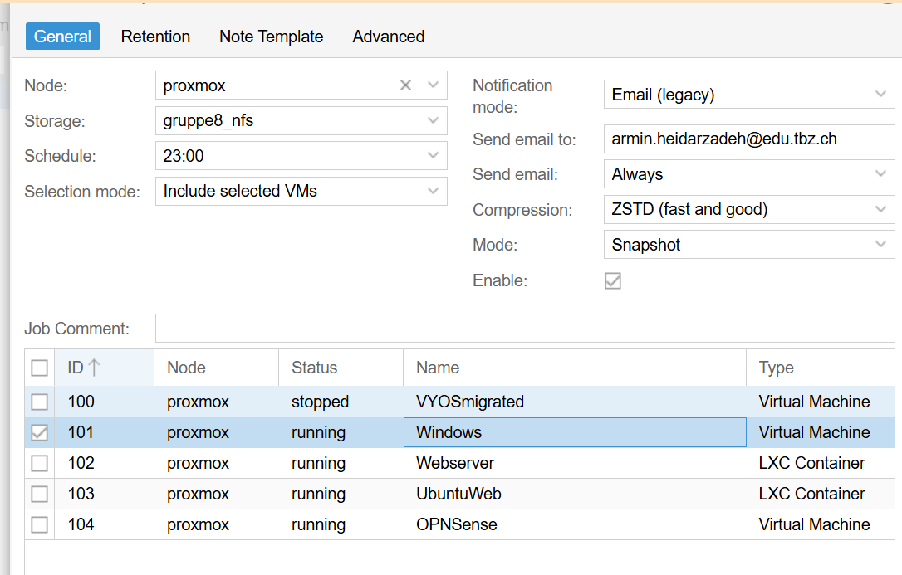

Was nach Absprache mit dem Lehrer nun als Erkenntis gewonnen wurde ist das es möglicherweise auch noch in den Storage Einstellungen beim NFS abgeändert werden muss:
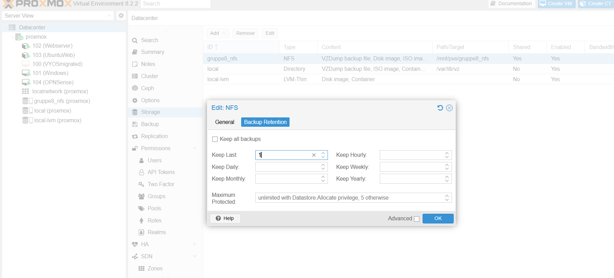

**3. Speicherung der Backup-Daten auf NFS-Speicher Einbindung (wurde bereits gemacht):**

- In der Proxmox-Weboberfläche: Navigieren Sie zu "Datacenter" > "Storage".
- Klicken Sie auf "Add" und wählen Sie "NFS".
- Geben Sie die IP-Adresse und den Pfad Ihres NFS-Servers sowie einen Namen für den Speicher ein.
- Speichern Sie die Einstellungen.

**4. E-Mail-Benachrichtigungen bei Fehlern konfigurieren:**

- In der Proxmox-Weboberfläche: Navigieren Sie zu "Datacenter" > "Options".
- Klicken Sie auf "Edit".
- Unter "Email" geben Sie die SMTP-Serverdetails Ihres E-Mail-Anbieters ein.
- Geben Sie Ihre E-Mail-Adresse als Empfänger für Benachrichtigungen an.
- Speichern Sie die Einstellungen.
- (Ich habe einfach für das Backup meine Mail angegeben und es kam eine Mail des erfolgreichen Backups)

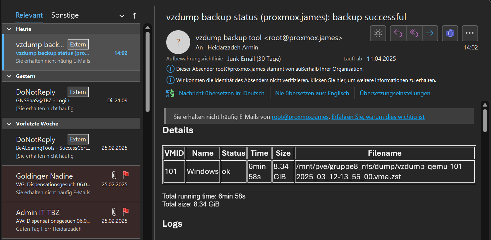

**Links hierzu:** <br>
[Fedora-Site](https://fedorapeople.org/groups/virt/virtio-win/direct-downloads/archive-virtio/) <br>
[VirtIO-Proxmox](https://pve.proxmox.com/wiki/Windows_VirtIO_Drivers)


## 10. Block Repetition

**1. Repetition Proxmox** <br>
**2. Repetition Begriffe**

### 10.1 Auftrag: Repetition Begriffe

**Erklären Sie folgende Begriffe:**

**Hypervisor Typ 1 (Bare-Metal)**

- Siehe Antwort oben.
- Ein Hypervisor vom Typ 1 läuft direkt auf der physischen Hardware des Hosts und ersetzt das herkömmliche Betriebssystem. Er ermöglicht die Erstellung und Verwaltung mehrerer virtueller Maschinen (VMs) und wird häufig in Serverumgebungen eingesetzt. 

**Hypervisor Typ 2**

- SIehe Antwort oben.
- Ein Hypervisor vom Typ 2 läuft als Anwendung auf einem bestehenden Betriebssystem. Er ermöglicht die Ausführung von VMs auf Endgeräten, um alternative Betriebssysteme zu nutzen. Diese Hypervisoren greifen über das Host-Betriebssystem auf die Hardware-Ressourcen zu, was zu Leistungseinbußen führen kann.

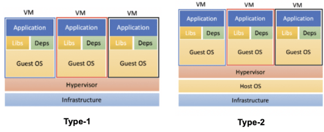

**Isolationsgrad**

- Siehe Antwort oben.
- Der Isolationsgrad beschreibt, wie stark virtuelle Maschinen oder Container voneinander und vom Hostsystem getrennt sind. Ein hoher Isolationsgrad erhöht die Sicherheit und Stabilität, da Probleme in einer VM oder einem Container die anderen nicht beeinflussen.

**Emulation**

- Siehe Antwort oben.
- Der Isolationsgrad beschreibt, wie stark virtuelle Maschinen oder Container voneinander und vom Hostsystem getrennt sind. Ein hoher Isolationsgrad erhöht die Sicherheit und Stabilität, da Probleme in einer VM oder einem Container die anderen nicht beeinflussen.
- Ahmt Hardware auf Softwareebene nach, während **Virtualisierung** eine direkte Nutzung der Hardware mit einer virtuellen Abstraktionsschicht ermöglicht.

**Gastbetriebssystem**

- Ein Gastbetriebssystem ist das Betriebssystem, das innerhalb einer virtuellen Maschine läuft. Es unterscheidet sich vom Host-Betriebssystem, das direkt auf der physischen Hardware installiert ist.

**Server Virtualisierung**

- Bei der Server-Virtualisierung werden die Ressourcen eines physischen Servers in mehrere virtuelle Server aufgeteilt. Dies ermöglicht eine effizientere Nutzung der Hardware und erleichtert das Management.

**Desktop Virtualisierung**

- Desktop-Virtualisierung trennt den Desktop-Betriebssystem- und Anwendungsstack vom physischen Client-Gerät. Dadurch können Benutzer von verschiedenen Geräten auf ihren personalisierten Desktop zugreifen.
- Siehe Antwort oben.

**Applikations Virtualisierung**

- Siehe Antwort oben.
- Bei der Applikations-Virtualisierung werden Anwendungen von dem zugrunde liegenden Betriebssystem abstrahiert. Dies ermöglicht es, Anwendungen in isolierten Containern auszuführen, wodurch Konflikte mit anderen Anwendungen vermieden werden.

**Betriebssystem / OS Virtualisierung NOCH FRAGEN**

- Siehe Antwort oben.

- Diese Form der Virtualisierung ermöglicht es, mehrere isolierte Benutzerrauminstanzen auf einem einzigen Betriebssystemkern auszuführen. Container-Technologien wie LXC und OpenVZ nutzen dieses Prinzip.

**Container Virtualisierung NOCH FRAGEN**

- Container-Virtualisierung ermöglicht es, Anwendungen und ihre Abhängigkeiten in Containern zu isolieren, die auf demselben Betriebssystemkernel laufen. Dies führt zu einer effizienten Ressourcennutzung und Portabilität.

**LXC**

- Siehe Antwort oben.
- LXC ist eine Technologie zur Containervirtualisierung auf Betriebssystemebene unter Linux. Sie ermöglicht es, mehrere isolierte Linux-Systeme auf einem einzigen Host auszuführen, wobei alle Container denselben Kernel teilen.

**OpenVZ**

- Siehe Antwort oben.
- OpenVZ ist eine Virtualisierungstechnologie für Linux, die mehrere isolierte Container erstellt. Jeder Container verhält sich wie ein eigenständiger Server, teilt jedoch den gleichen Linux-Kernel mit anderen Containern auf dem Host.

**Total Cost of Ownership (TOC)**

- Siehe Antwort oben.
- Der Gesamtbesitzkostenansatz berücksichtigt alle direkten und indirekten Kosten, die mit dem Erwerb, Betrieb und der Wartung eines Systems oder Produkts verbunden sind.

**Konsolidieren**

-  In der IT bezieht sich Konsolidierung auf die Zusammenführung mehrerer Systeme oder Dienste, um Ressourcen effizienter zu nutzen und die Verwaltung zu vereinfachen.

**Snapshot**

- Siehe Antwort oben.
- Ein Snapshot ist eine Momentaufnahme des aktuellen Zustands eines Systems oder einer virtuellen Maschine zu einem bestimmten Zeitpunkt. Er ermöglicht es, diesen Zustand später wiederherzustellen.

**Sandbox**

- Eine Sandbox ist eine isolierte Testumgebung, in der Programme ausgeführt oder Code getestet werden kann, ohne das restliche System zu gefährden.

**.VMX Datei**

- Eine .vmx-Datei ist die Konfigurationsdatei einer VMware-virtuellen Maschine. Sie enthält Einstellungen und Parameter für den Betrieb der VM.

**.VMDK Datei**

- Eine .vmdk-Datei ist eine virtuelle Festplattendatei im VMware-Format. Sie repräsentiert die Festplatte einer virtuellen Maschine.

**.VDI Datei**

- Eine .vdi-Datei ist eine virtuelle Festplattendatei im VirtualBox-Format. Sie dient als Speichermedium für virtuelle Maschinen in VirtualBox.

**.VHDX Datei**

- Eine .vhdx-Datei ist ein Microsoft-Format für virtuelle Festplattendateien, das in Hyper-V verwendet wird. Es bietet erweiterte Funktionen gegenüber dem älteren .vhd-Format.

**Thin Allocation**

- Siehe Antwort oben.
- Bei der Thin Provisioning (dünnen Bereitstellung) wird Speicherplatz nach Bedarf zugewiesen, anstatt im Voraus den gesamten Speicher zu reservieren. Dies optimiert die Ressourcennutzung.

**Thick Allocation**

- Siehe Antwort oben
- Bei der Thick Provisioning (dicken Bereitstellung) wird der gesamte benötigte Speicherplatz im Voraus reserviert, unabhängig davon, ob er sofort genutzt wird oder nicht.

**Write-Back Chache**

- Siehe Antwort oben.
- Ein Write-Back-Cache speichert Schreiboperationen zunächst im Cache und bestätigt dem System den Abschluss. Die Daten werden später auf das Hauptspeichermedium geschrieben, was die Schreibgeschwindigkeit erhöht.

**Write-Through Cache**

- Siehe Antwort oben.
- Ein Write-Through-Cache schreibt Daten gleichzeitig in den Cache und auf das Hauptspeichermedium. Dies stellt sicher, dass die Daten sofort persistent sind, kann jedoch die Schreibgeschwindigkeit reduzieren.

**IOPS**

- Siehe Antwort oben.
- IOPS ist eine Leistungskennzahl, die die Anzahl der Ein- und Ausgabeoperationen pro Sekunde eines Speichersystems angibt.

**High Performance RAID**

- RAID (Redundant Array of Independent Disks) kombiniert mehrere physische Festplatten zu einem logischen Laufwerk, um Leistung und/oder Redundanz zu erhöhen. High-Performance-RAID-Konfigurationen, wie RAID 0 (Striping) oder RAID 10 (Kombination aus Striping und Mirroring), bieten erhöhte Datenübertragungsraten und verbesserte Ausfallsicherheit.

**SAN**

- Ein SAN ist ein dediziertes Hochgeschwindigkeitsnetzwerk, das Server mit gemeinsam genutzten Speicherpools verbindet. Es ermöglicht einen schnellen, blockbasierten Zugriff auf Speicherressourcen und wird häufig für leistungskritische Anwendungen in Unternehmen eingesetzt.

**NAS**

- NAS ist ein Speichergerät, das direkt an ein Netzwerk angeschlossen ist und dateibasierten Speicherzugriff ermöglicht. Es bietet eine zentrale Stelle für die Speicherung und den Zugriff auf Dateien und ist besonders nützlich für die gemeinsame Nutzung von Daten in Arbeitsgruppen oder Unternehmen.

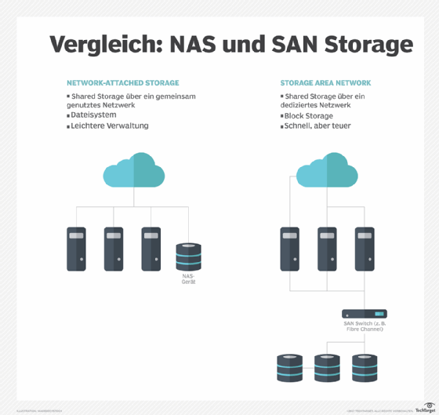

**Shared Storage**

- Siehe Antwort oben.
- Speicher bezieht sich auf Speicherressourcen, die von mehreren Servern oder Benutzern gleichzeitig genutzt werden können. Dies erleichtert die Zusammenarbeit, erhöht die Effizienz und ermöglicht Funktionen wie Hochverfügbarkeit und Lastverteilung.

**NFS (Network File System)**

- NFS ist ein verteiltes Dateisystemprotokoll, das es einem Computer ermöglicht, auf Dateien über ein Netzwerk so zuzugreifen, als wären sie auf der lokalen Festplatte gespeichert. Es wird häufig in UNIX- und Linux-Umgebungen verwendet.

**NFS Async/Sync**

- Diese Begriffe beziehen sich auf die Art und Weise, wie NFS Schreiboperationen handhabt:​

  - Sync (synchron): Schreiboperationen werden erst als abgeschlossen betrachtet, wenn die Daten tatsächlich auf dem Speichergerät geschrieben wurden. Dies gewährleistet Datenintegrität, kann jedoch die Leistung beeinträchtigen.​

  - Async (asynchron): Schreiboperationen werden als abgeschlossen betrachtet, sobald sie im Speicher des Servers angekommen sind, bevor sie auf das Speichergerät geschrieben wurden. Dies kann die Leistung verbessern, birgt jedoch ein höheres Risiko für Datenverlust bei einem Systemausfall.

**Bridged**

- Siehe Antwort oben.
- In der Virtualisierung ermöglicht ein Bridged Network einer virtuellen Maschine (VM), direkt mit dem physischen Netzwerk zu kommunizieren, als wäre sie ein eigenständiges physisches Gerät. Die VM erhält eine eigene IP-Adresse im selben Netzwerk wie der Host.

**Host-Only Network**

- Siehe Antwort oben.
- Ein Host-Only Network ist ein Netzwerktyp, bei dem VMs nur mit dem Host und untereinander kommunizieren können, jedoch nicht mit externen Netzwerken. Dies wird häufig für Testumgebungen oder isolierte Netzwerke verwendet.

**NAT**

- Siehe Antwort oben.
- In der Virtualisierung ermöglicht NAT VMs den Zugriff auf externe Netzwerke (z. B. das Internet) über die IP-Adresse des Hosts. Die VMs befinden sich in einem privaten Netzwerk und ihre IP-Adressen werden vom Host übersetzt, wenn sie mit externen Netzwerken kommunizieren.​

**vmnet0**

- In VMware-Produkten ist "vmnet0" der Standardname für das virtuelle Netzwerk, das für Bridged Networking verwendet wird. Es verbindet VMs direkt mit dem physischen Netzwerk des Hosts.​ vmnet0 ist eigentlich eine virtuelle Brücke. Diese Brücke hat viele Ports. Ein Port wird verwendet, um eine Verbindung zu Ihrem Host herzustellen, und ein Port wird verwendet, um eine Verbindung zu Ihrer virtuellen Maschine herzustellen. 

**vSwitch0**

- Siehe Antwort oben.
- In VMware vSphere ist "vSwitch0" der Standardname für den ersten virtuellen Switch. Ein virtueller Switch ermöglicht die Netzwerkkommunikation zwischen VMs und verbindet sie mit physischen Netzwerken.​

**VLAN**

- Ein VLAN ermöglicht es, ein physisches Netzwerk in mehrere logische Netzwerke zu segmentieren. Dies verbessert die Netzwerkverwaltung, Sicherheit und Leistung, indem der Netzwerkverkehr isoliert wird.​

**Live Migration**

- Siehe Antwort oben.
- Live Migration bezeichnet den Prozess, eine laufende VM von einem physischen Host auf einen anderen zu verschieben, ohne die VM herunterzufahren oder den Dienst zu unterbrechen. Dies ermöglicht Wartungsarbeiten und Lastverteilung ohne Ausfallzeiten.​

**Full Clone**

- Siehe Antwort oben.
- Ein Full Clone ist eine vollständige Kopie einer VM, die unabhängig vom Original arbeitet. Nach dem Klonen gibt es keine Verbindung mehr zwischen dem Original und dem Klon.​

**Linked Clone**

- Siehe Antwort oben.
- Ein Linked Clone ist eine Kopie einer VM, die auf der Original-VM basiert und virtuelle Festplattendaten gemeinsam nutzt. Dies spart Speicherplatz, da nur die Unterschiede zur Original-VM gespeichert werden.​

**Windows Server Standard Edition**

- Die Standard Edition von Windows Server ist eine Version des Windows Server-Betriebssystems, die grundlegende Funktionen für kleine bis mittelgroße Unternehmen bietet, einschließlich Unterstützung für Virtualisierung, Speicher und Netzwerkdienste.​

**Windows Server Datacenter Edition**

- Die Datacenter Edition von Windows Server ist für große Unternehmen und Rechenzentren konzipiert. Sie bietet erweiterte Funktionen, einschließlich unbegrenzter Virtualisierungsrechte, erweiterter Speicher- und Netzwerkfunktionen sowie zusätzlicher Sicherheitsmerkmale.​

**POSE (Physical Operating System Environment)**

- Siehe Antwort oben.
- POSE bezieht sich auf die physische Instanz eines Betriebssystems, die direkt auf der Hardware eines Servers installiert ist.​

**VOSE (Virtual Operating System Environment)**

- Siehe Antwort oben.
- VOSE bezieht sich auf eine virtuelle Instanz eines Betriebssystems, die innerhalb einer VM auf einem Hypervisor läuft.​

**CAL (Client Access License)**

- Siehe Antwort oben.
- Eine CAL ist eine Lizenz, die einem Benutzer oder Gerät das Recht gibt, auf die Dienste eines Servers zuzugreifen. In Microsoft-Umgebungen sind CALs erforderlich, um sicherzustellen, dass der Zugriff auf Serverdienste lizenziert ist.


### 10.2 Auftrag: Repetition Proxmox

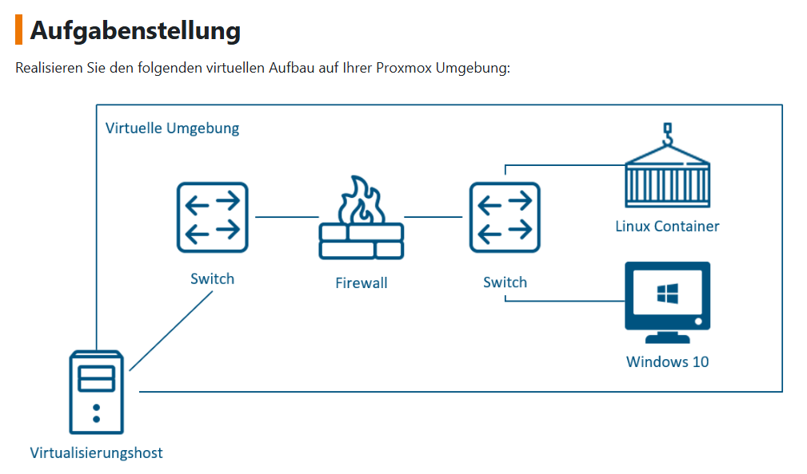

**Installieren Sie eine Firewall, eine Windows VM und einen Linux Container.**

- Die Umgebung wurde aus der Übung 7.4 übernommen.

**Alle VMs haben Zugriff auf das Internet.**

- Durch die Standard Firewall-Regel fürs LAN sollte der Zugriff bereits funktionieren. Ich habe hierfür die Umgebung der Aufgabe 7.4 übernommen, das DMZ (inklusive virtueller Switch) entfernt und dies noch beim betroffenen Linux Container angepasst. 

**Die Windows VM und der Linux Container greifen über die Firewall auf das Internet zu.**

- Wurde mit der letzten Frage bereits beantwortet.

**Testen Sie die Diskperformance auf der Windows VM mit und ohne Write-Back Cache (Proxmox Harddisk Cache) und halten Sie Ihre Ergebnisse fest (Screenshot/Word).**

- Müssen wir doch nicht machen, da wir dies nicht durchgeführt haben, ansonsten mit einem Becnhmark-Tool versuchen.

**Erstellen Sie ein regelmässiges Backup alles VMs und verwenden Sie die beste Kompression.**

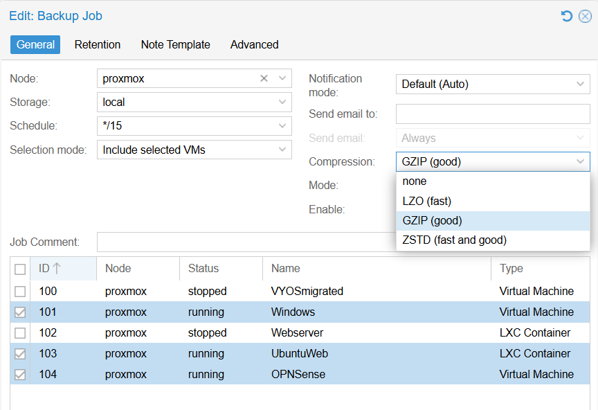

**Sorgen Sie dafür, dass der Linux Container von Aussen per SSH erreichbar ist und testen Sie den SSH Zugang von Ihrem Workplace mit Putty.**

- In der Shell des Linux Containers kann man folgendes durchführen:
```Shell
nano /etc/ssh/sshd_config
PermitRootLogin yes
systemctl restart ssh
```

**Im OPNsense-Webinterface - NAT-Portweiterleitungsregel erstellen:**

- Navigieren Sie zu Firewall > NAT > Port Forward.​
- Klicken Sie auf Add (Hinzufügen)
- Interface: WAN
- Protocol: TCP
- Destination: WAN address
- Destination port range: SSH (Port 22)
- Redirect target IP: Interne IP-Adresse des Linux-Containers (192.168.1.30)
- Redirect target port: SSH (Port 22)
- Description (optional): NAT SSH to Linux Container
- Save und Apply Changes

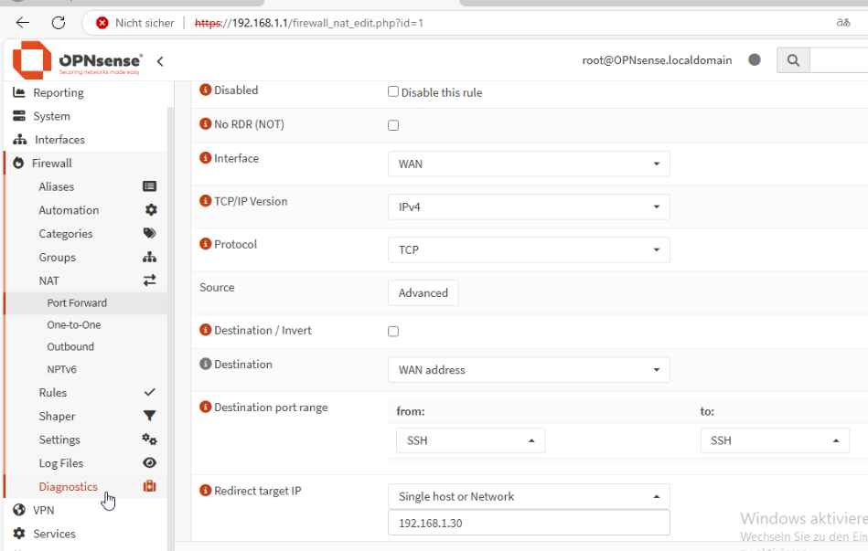

**Eine Firewall-Regel wird beim WAN zudem noch automatisch für SSH erstellt, falls manuell bevorzugt:**

- Action: Pass
- Interface: WAN
- Address Family: IPv4
- Protocol: TCP
- Source: Any
- Destination: 192.168.1.30 (Container)
- Destination port range: SSH (Port 22)
- Description (optional): Allow SSH to Linux Container
- Save und Apply Changes

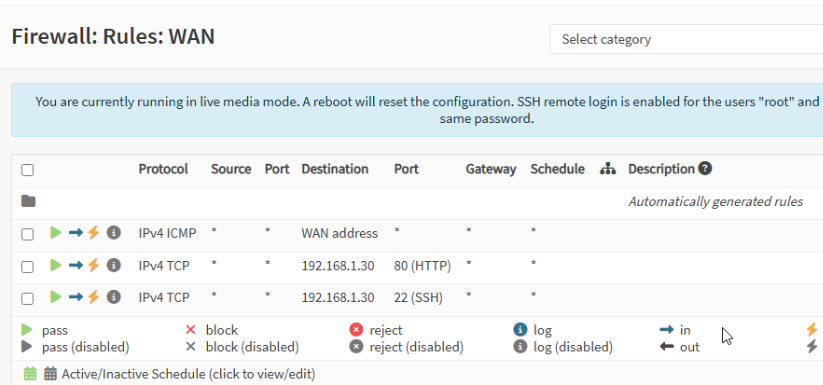

**Auszug aus Putty:**

```Shell
login as: root
root@213.167.226.173's password:
Welcome to Ubuntu 22.04 LTS (GNU/Linux 6.8.4-2-pve x86_64)

 * Documentation:  https://help.ubuntu.com
 * Management:     https://landscape.canonical.com
 * Support:        https://ubuntu.com/advantage
Last login: Thu Mar 13 09:58:49 2025 from 62.12.166.130
root@UbuntuWeb:~#
```